---
## Front matter
title: "Отчет по лабораторной работе №2"
subtitle: "дисциплина: Операционные системы"
author: "Анастасия Сергеевна Маслова, НКНбд-01-21"

## Generic otions
lang: ru-RU
toc-title: "Содержание"

## Bibliography
bibliography: bib/cite.bib
csl: pandoc/csl/gost-r-7-0-5-2008-numeric.csl

## Pdf output format
toc: true # Table of contents
toc-depth: 2
lof: true # List of figures
lot: true # List of tables
fontsize: 12pt
linestretch: 1.5
papersize: a4
documentclass: scrreprt
## I18n polyglossia
polyglossia-lang:
  name: russian
  options:
	- spelling=modern
	- babelshorthands=true
polyglossia-otherlangs:
  name: english
## I18n babel
babel-lang: russian
babel-otherlangs: english
## Fonts
mainfont: PT Serif
romanfont: PT Serif
sansfont: PT Sans
monofont: PT Mono
mainfontoptions: Ligatures=TeX
romanfontoptions: Ligatures=TeX
sansfontoptions: Ligatures=TeX,Scale=MatchLowercase
monofontoptions: Scale=MatchLowercase,Scale=0.9
## Biblatex
biblatex: true
biblio-style: "gost-numeric"
biblatexoptions:
  - parentracker=true
  - backend=biber
  - hyperref=auto
  - language=auto
  - autolang=other*
  - citestyle=gost-numeric
## Pandoc-crossref LaTeX customization
figureTitle: "Рис."
tableTitle: "Таблица"
listingTitle: "Листинг"
lofTitle: "Список иллюстраций"
lotTitle: "Список таблиц"
lolTitle: "Листинги"
## Misc options
indent: true
header-includes:
  - \usepackage{indentfirst}
  - \usepackage{float} # keep figures where there are in the text
  - \floatplacement{figure}{H} # keep figures where there are in the text
---

# Цель работы

Изучить идеалогию и применение средств контроля версий, освоить навыки работы с git.

# Задание

Создать базовую конфигурацию для работы с git.
- Создать ключ SSH.
- Создать ключ PGP.
- Настроить подписи git.
- Зарегистрироваться на Github.
- Создать локальный каталог для выполнения заданий по предмету.


# Теоретическое введение

Наиболее часто используемые команды git:
- создание основного дерева репозитория:
``` bash
git init
```
- получение обновлений (изменений) текущего дерева из центрального репозитория:
``` bash
git pull
```
- отправка всех произведённых изменений локального дерева в центральный репозиторий:
``` bash
git push
```
- просмотр списка изменённых файлов в текущей директории:
``` bash
git status
```
- просмотр текущих изменения:
``` bash
git diff
```
- сохранение текущих изменений:
	- добавить все изменённые и/или созданные файлы и/или каталоги:
	``` bash
	git add .
	```
	- добавить конкретные изменённые и/или созданные файлы и/или каталоги:
	``` bash
	git add имена_файлов
	```
	- удалить файл и/или каталог из индекса репозитория (при этом файл и/или каталог
остаётся в локальной директории):
	``` bash
	git rm имена_файлов
	```
- сохранение добавленных изменений:
	- сохранить все добавленные изменения и все изменённые файлы:
	``` bash
	git commit -am 'Описание коммита'
	```
	- сохранить добавленные изменения с внесением комментария через встроенный
редактор:
	```bash
	git commit
	```
- создание новой ветки, базирующейся на текущей:
```bash
git checkout -b имя_ветки
```
- переключение на некоторую ветку:
```bash
git checkout имя_ветки
```
(при переключении на ветку, которой ещё нет в локальном репозитории, она будет
создана и связана с удалённой)
- отправка изменений конкретной ветки в центральный репозиторий:
```bash
 git push origin имя_ветки
```
- слияние ветки с текущим деревом:
```bash
git merge --no-ff имя_ветки
```
- удаление ветки:
	- удаление локальной уже слитой с основным деревом ветки:
	```bash
	git branch -d имя_ветки
	```
	- принудительное удаление локальной ветки:
	```bash
	git branch -D имя_ветки
	```
	- удаление ветки с центрального репозитория:
	```bash
	git push origin :имя_ветки
	```
Более подробную теоретическую часть смотрите [здесь](https://esystem.rudn.ru/pluginfile.php/1383169/mod_resource/content/4/002-lab_vcs.pdf).

# Выполнение лабораторной работы

Я создала аккаунт на github.com, заполнила основные данные, после чего приступила к установке программного обеспечения. В первую очередь я занялась установкой git-flow (рис.1), потом gh, затем приступила к настройке git (рис.2).

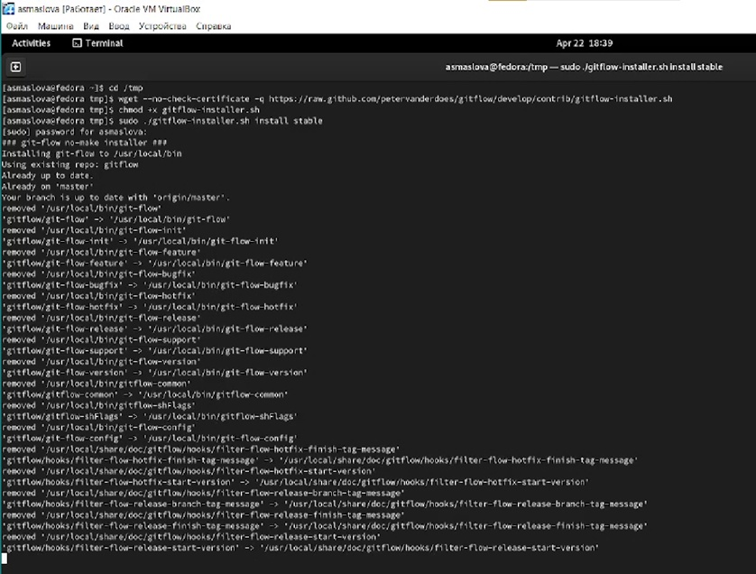  рис.1

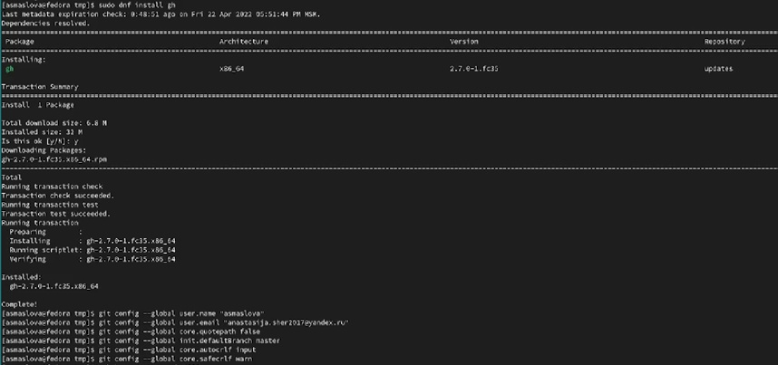 рис.2

Следующим шагом я создала ключи ssh (рис.3) и pgp (рис.4).

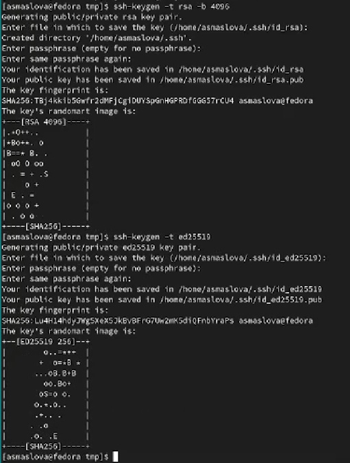 рис.3

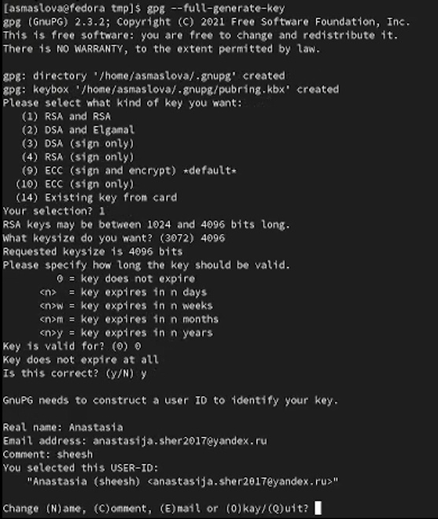 рис.4

После этого я добавила PGP ключ в GitHub (рис.5-7), разобралась с настройкой автоматических подписей коммитов git (рис.8) и настройкой gh (рис.8-9).

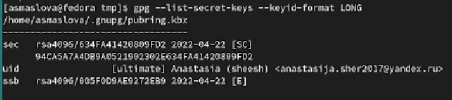 рис.5

 рис.6

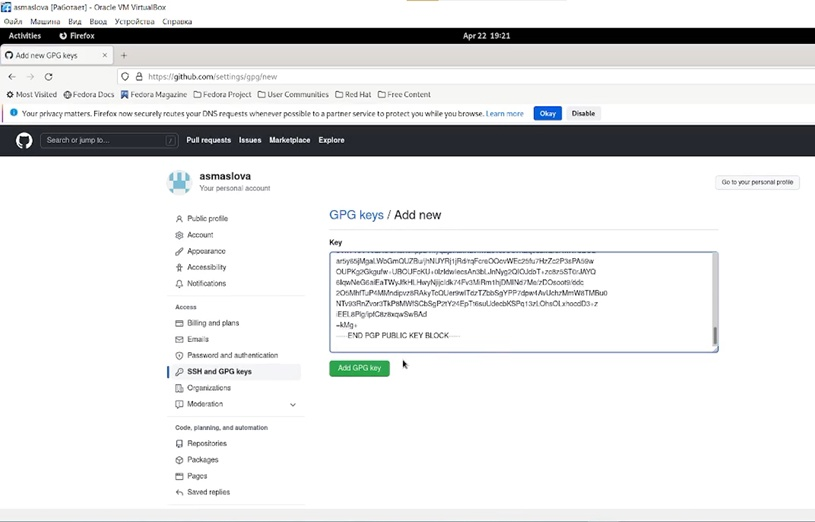 рис.7

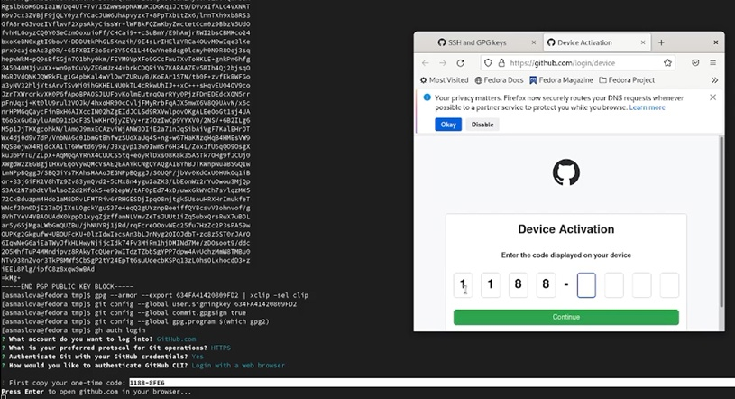 рис.8

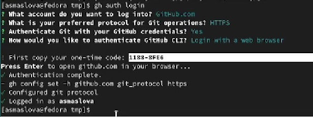 рис.9

Затем я создала репозиторий на основе шаблона (рис.10-11) и настроила каталог курса (рис.12-13).

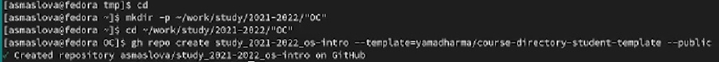 рис.10

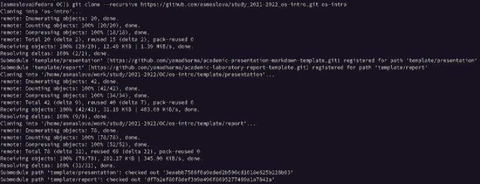 рис.11

 рис.12

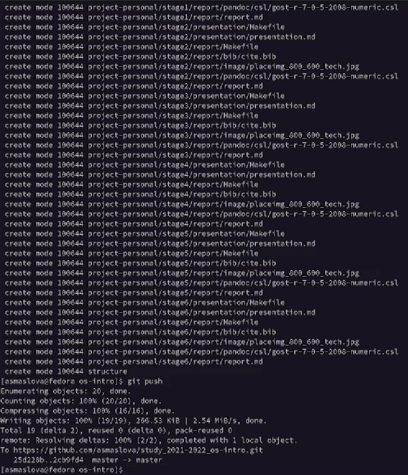 рис.13

# Выводы

В ходе лабораторной работы я получила практические навыки в работе с git.

# Список литературы
[Лабораторная работа №2. Управление версиями. ](https://esystem.rudn.ru/pluginfile.php/1383169/mod_resource/content/4/002-lab_vcs.pdf)
