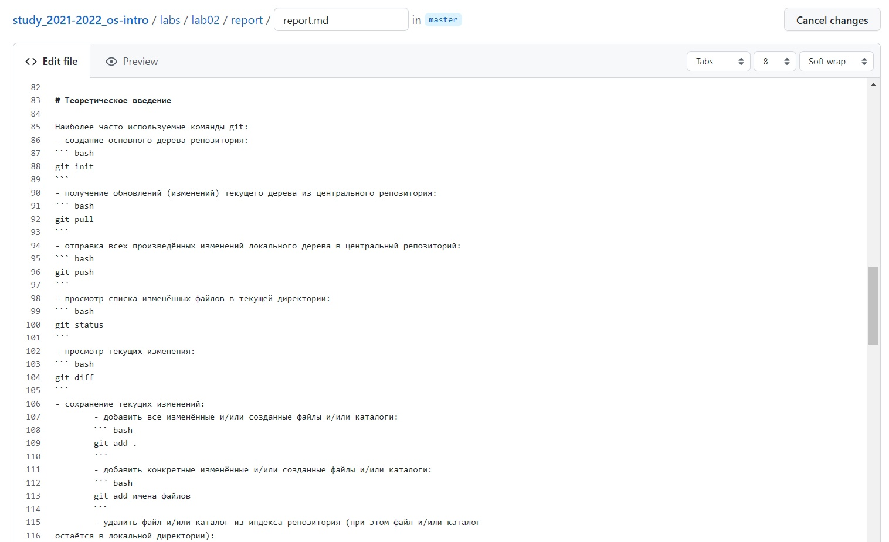
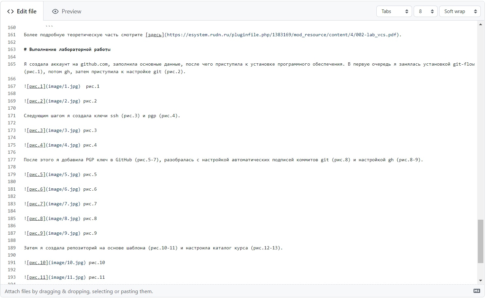
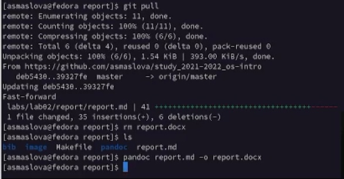
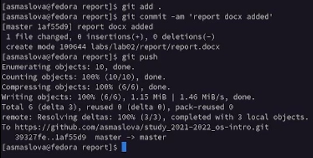
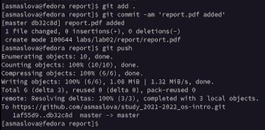

---
## Front matter
title: "Отчет по лабораторной работе №3"
subtitle: "Дисциплина: Операционные системы"
author: "Маслова Анастасия Сергеевна, НКНбд-01-21"

## Generic otions
lang: ru-RU
toc-title: "Содержание"

## Bibliography
bibliography: bib/cite.bib
csl: pandoc/csl/gost-r-7-0-5-2008-numeric.csl

## Pdf output format
toc: true # Table of contents
toc-depth: 2
lof: true # List of figures
lot: true # List of tables
fontsize: 12pt
linestretch: 1.5
papersize: a4
documentclass: scrreprt
## I18n polyglossia
polyglossia-lang:
  name: russian
  options:
	- spelling=modern
	- babelshorthands=true
polyglossia-otherlangs:
  name: english
## I18n babel
babel-lang: russian
babel-otherlangs: english
## Fonts
mainfont: PT Serif
romanfont: PT Serif
sansfont: PT Sans
monofont: PT Mono
mainfontoptions: Ligatures=TeX
romanfontoptions: Ligatures=TeX
sansfontoptions: Ligatures=TeX,Scale=MatchLowercase
monofontoptions: Scale=MatchLowercase,Scale=0.9
## Biblatex
biblatex: true
biblio-style: "gost-numeric"
biblatexoptions:
  - parentracker=true
  - backend=biber
  - hyperref=auto
  - language=auto
  - autolang=other*
  - citestyle=gost-numeric
## Pandoc-crossref LaTeX customization
figureTitle: "Рис."
tableTitle: "Таблица"
listingTitle: "Листинг"
lofTitle: "Список иллюстраций"
lotTitle: "Список таблиц"
lolTitle: "Листинги"
## Misc options
indent: true
header-includes:
  - \usepackage{indentfirst}
  - \usepackage{float} # keep figures where there are in the text
  - \floatplacement{figure}{H} # keep figures where there are in the text
---

# Цель работы

Получить практические навыки работы с легковесным языком разметки Markdown, научится оформлять с его помощью отчеты.

# Задание

>- Сделайте отчёт по предыдущей лабораторной работе в формате Markdown.
>- В качестве отчёта просьба предоставить отчёты в 3 форматах: pdf, docx и md (в архиве, поскольку он должен содержать скриншоты, Makefile и т.д.)

# Теоретическое введение

Чтобы создать заголовок, используйте знак ( # ), например:
```bash
# This is heading 1
## This is heading 2
### This is heading 3
#### This is heading 4
```

Чтобы задать для текста полужирное начертание, заключите его в двойные звездочки:
```bash
This text is **bold**.
```

Чтобы задать для текста курсивное начертание, заключите его в одинарные звездочки:
```bash
This text is *italic*.
```

Чтобы задать для текста полужирное и курсивное начертание, заключите его в тройные
звездочки:
```bash
This is text is both ***bold and italic***.
```

Блоки цитирования создаются с помощью символа >:
```bash
> The drought had lasted now for ten million years, and the reign of
the terrible lizards had long since ended. Here on the Equator, in
the continent which would one day be known as Africa, the battle
for existence had reached a new climax of ferocity, and the victor
was not yet in sight. In this barren and desiccated land, only the
small or the swift or the fierce could flourish, or even hope to
survive.
↪
↪
↪
↪
↪
↪
```

Неупорядоченный (маркированный) список можно отформатировать с помощью звездочек или тире:
```bash
- List item 1
- List item 2
- List item 3
```

Чтобы вложить один список в другой, добавьте отступ для элементов дочернего списка:
```bash
- List item 1
	- List item A
	- List item B
- List item 2
```
Упорядоченный список можно отформатировать с помощью соответствующих цифр:
```bash
1. First instruction
1. Second instruction
1. Third instruction
```

Чтобы вложить один список в другой, добавьте отступ для элементов дочернего списка:
```bash
1. First instruction
	1. Sub-instruction
	1. Sub-instruction
1. Second instruction
```

Синтаксис Markdown для встроенной ссылки состоит из части [link text] , представляющей текст гиперссылки, и части (file-name.md) – URL-адреса или имени файла,
на который дается ссылка:
```bash
[link text](file-name.md)
```

Markdown поддерживает как встраивание фрагментов кода в предложение, так и их размещение между предложениями в виде отдельных огражденных блоков. Огражденные
блоки кода — это простой способ выделить синтаксис для фрагментов кода. Общий формат огражденных блоков кода:
```bash
``` language
your code goes in here
(```) , без скобок
```
Верхние и нижние индексы:

H~2~ записывается как
```bash
H~2~
```

2^10^ записывается как
```bash
2^10^
```

Внутритекстовые формулы делаются аналогично формулам LaTeX. Например, формула $\sin^2 (x) + \cos^2 (x) = 1$ запишется как
```bash
$\sin^2 (x) + \cos^2 (x) = 1$
```
Выключные формулы: 
$$\sin^2 (x) + \cos^2 (x) = 1$$ {#eq:eq:sin2+cos2} 
со ссылкой в тексте «Смотри формулу ([-@eq:eq:sin2+cos2]).» записывается как
```bash
$$
\sin^2 (x) + \cos^2 (x) = 1
$$ {#eq:eq:sin2+cos2}

Смотри формулу ([-@eq:eq:sin2+cos2]).
```

# Выполнение лабораторной работы

Сначала я открыла шаблон отчета на github, и начала редактировать его в соответствии с инструкциями и требованиями (рис.1-2).

 
*рис.1 Оформление кода и списков в markdown*


*рис.2 Оформление ссылок и картинок в markdown*

Далее с помощью pandoc я преобразовала файл отчета из .md в .docx (рис.3)


*рис.3 Преобразование файла markdown в docx с помощью pandoc*

Далее я, преобразовав в pdf, отправила оба файла отчета в репозиторий (рис.4-6).


*рис.4 Отправка report.docx в репозиторий*


*рис.5 Преобразование .docx в pdf*


*рис.6 Отправка .pdf в репозиторий*

# Выводы

В результате лабораторной работы я получила навыки работы с markdown и научилась правильно оформлять отчеты.

# Список литературы{.unnumbered}

[Операционные системы. Лабораторная работа №3.](https://esystem.rudn.ru/pluginfile.php/1383171/mod_resource/content/3/003-lab_markdown.pdf)
