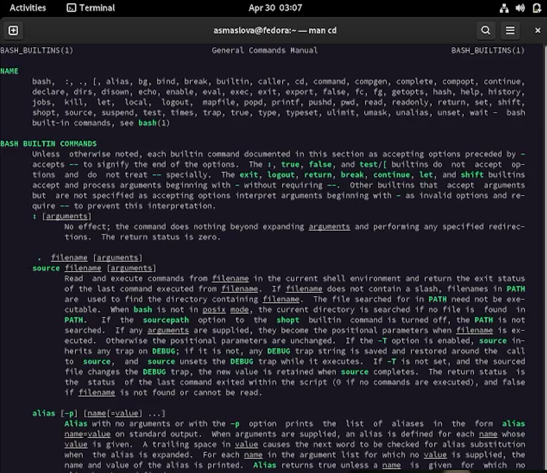

---
## Front matter
title: "Отчет по лабораторной работе №4"
subtitle: "Дисциплина: Операционные системы"
author: "Маслова Анастасия, НКНбд-01-21"

## Generic otions
lang: ru-RU
toc-title: "Содержание"

## Bibliography
bibliography: bib/cite.bib
csl: pandoc/csl/gost-r-7-0-5-2008-numeric.csl

## Pdf output format
toc: true # Table of contents
toc-depth: 2
lof: true # List of figures
lot: true # List of tables
fontsize: 12pt
linestretch: 1.5
papersize: a4
documentclass: scrreprt
## I18n polyglossia
polyglossia-lang:
  name: russian
  options:
	- spelling=modern
	- babelshorthands=true
polyglossia-otherlangs:
  name: english
## I18n babel
babel-lang: russian
babel-otherlangs: english
## Fonts
mainfont: PT Serif
romanfont: PT Serif
sansfont: PT Sans
monofont: PT Mono
mainfontoptions: Ligatures=TeX
romanfontoptions: Ligatures=TeX
sansfontoptions: Ligatures=TeX,Scale=MatchLowercase
monofontoptions: Scale=MatchLowercase,Scale=0.9
## Biblatex
biblatex: true
biblio-style: "gost-numeric"
biblatexoptions:
  - parentracker=true
  - backend=biber
  - hyperref=auto
  - language=auto
  - autolang=other*
  - citestyle=gost-numeric
## Pandoc-crossref LaTeX customization
figureTitle: "Рис."
tableTitle: "Таблица"
listingTitle: "Листинг"
lofTitle: "Список иллюстраций"
lotTitle: "Список таблиц"
lolTitle: "Листинги"
## Misc options
indent: true
header-includes:
  - \usepackage{indentfirst}
  - \usepackage{float} # keep figures where there are in the text
  - \floatplacement{figure}{H} # keep figures where there are in the text
---

# Цель работы

Приобретение практических навыков взаимодействия пользователя с системой посредством командной строки.

# Задание

1. Определите полное имя вашего домашнего каталога. Далее относительно этого каталога будут выполняться последующие упражнения.
2. Выполните следующие действия:
	2.1. Перейдите в каталог /tmp.
	2.2. Выведите на экран содержимое каталога /tmp. Для этого используйте команду ls с различными опциями. Поясните разницу в выводимой на экран информации.
	2.3. Определите, есть ли в каталоге /var/spool подкаталог с именем cron?
	2.4. Перейдите в Ваш домашний каталог и выведите на экран его содержимое. Определите, кто является владельцем файлов и подкаталогов?
3. Выполните следующие действия:
	3.1. В домашнем каталоге создайте новый каталог с именем newdir.
	3.2. В каталоге ~/newdir создайте новый каталог с именем morefun.
	3.3. В домашнем каталоге создайте одной командой три новых каталога с именами letters, memos, misk. Затем удалите эти каталоги одной командой.
	3.4. Попробуйте удалить ранее созданный каталог ~/newdir командой rm. Проверьте, был ли каталог удалён.
	3.5. Удалите каталог ~/newdir/morefun из домашнего каталога. Проверьте, был ли каталог удалён.
4. С помощью команды man определите, какую опцию команды ls нужно использовать для просмотра содержимое не только указанного каталога, но и подкаталогов,
входящих в него.
5. С помощью команды man определите набор опций команды ls, позволяющий отсортировать по времени последнего изменения выводимый список содержимого каталога
с развёрнутым описанием файлов.
6. Используйте команду man для просмотра описания следующих команд: cd, pwd, mkdir,
rmdir, rm. Поясните основные опции этих команд.
7. Используя информацию, полученную при помощи команды history, выполните модификацию и исполнение нескольких команд из буфера команд.

# Теоретическое введение

## Команда man
Команда man используется для просмотра (оперативная помощь) в диалоговом режиме руководства (manual) по основным командам операционной системы типа Linux.
Формат команды:
man <команда>
Пример (вывод информации о команде man):
``` bash
man man
```
Для управления просмотром результата выполнения команды man можно использовать следующие клавиши:
- Space — перемещение по документу на одну страницу вперёд;
- Enter — перемещение по документу на одну строку вперёд;
- q — выход из режима просмотра описания.

## Команда cd 
Команда cd используется для перемещения по файловой системе операционной системы типа Linux.

**Замечание 1.** Файловая система ОС типа Linux — иерархическая система каталогов, подкаталогов и файлов, которые обычно организованы и сгруппированы по функциональному признаку. Самый верхний каталог в иерархии называется корневым и обозначается символом /. Корневой каталог содержит системные файлы и другие каталоги.
Формат команды:
cd [путь_к_каталогу]

Для перехода в домашний каталог пользователя следует использовать команду cd без параметров или cd ~. Например, команда
```bash
cd /afs/dk.sci.pfu.edu.ru/home
```
позволяет перейти в каталог /afs/dk.sci.pfu.edu.ru/home (если такой существует), а для того, чтобы подняться выше на одну директорию, следует использовать:
```bash
cd ..
```
Подробнее об опциях команды cd смотри в справке с помощью команды man:
```bash
man cd
```
## Команда pwd 
Для определения абсолютного пути к текущему каталогу используется команда pwd (print working directory). Пример (абсолютное имя текущего каталога пользователя dharma):
```bash
pwd
```
результат:
```bash
/afs/dk.sci.pfu.edu.ru/home/d/h/dharma
```

Более подробную теорию можно найти [здесь](https://esystem.rudn.ru/mod/resource/view.php?id=862462)

# Выполнение лабораторной работы

1. С помощью команды pwd я определила полное имя домашнего каталога (рис.1).

2. Далее я перешла в каталог /tmp, вывела на экран его содержимое (рис.1), а также попробовала использовать различные опции *ls* (рис.2-5). 

 

рис.1 Результат работы функции *pwd* и переход в каталог tmp

 

рис.2 Выполнение функции *ls* с опцией *-a*

 

рис.3 Выполнение функции *ls* с опцией *-F*

 

рис.4 Выполнение функции *ls* с опцией *-l*

 

рис.5 Выполнение функции *ls* с опцией *-alF*


После с помощью команды *ls -a* я обнаружила, что в каталоге /var/spool не существует подкаталог с именем cron (рис.6)

 

рис.6 Поиск подкаталога cron в /var/spool


С помощью команды *ls -alF* я узнала, кто является владельцем файлов и подкаталогов (рис.7)

 

рис.7 Выполнение функции *ls* с опцией *-alF* на корневом каталоге


3. В домашнем каталоге я создала новый каталог с именем newdir. В каталоге ~/newdir я создала новый каталог с именем morefun. В домашнем каталоге я создала одной командой три новых каталога с именами letters, memos, misk. Затем я удалила эти каталоги одной командой. Далее я попробовала удалить ранее созданный каталог ~/newdir командой rm, но не смогла, так как без спец. опций функция *rm* не может удалять каталоги. Далее я удалила каталог ~/newdir/morefun из домашнего каталога с помощью *rmdir --ignore-fail-on-non-empty* (рис.8).

 

рис.8 Создание новых подкаталогов и попытка их удалить


4. С помощью команды man я определила, что с командой *ls* нужно использовать опцию *-R* для просмотра содержимого не только указанного каталога, но и подкаталогов,
входящих в него (рис.9-10).

 

рис.9 Результат вывода *man ls*


 

рис.10  Часть результата работы *ls -R*


5. С помощью команды man я определила, что опции *-t -l* функции *ls* позволяющет отсортировать по времени последнего изменения выводимый список содержимого каталога с развёрнутым описанием файлов (рис.11).

 

рис.11 Выполнение функции *ls* с опциями *-t -l* на корневом каталоге


6. С помощью команды man я просмотрела описания следующих команд: cd, pwd, mkdir, rmdir, rm (рис.12-16).

 

рис.12  Часть результата работы команды *man cd*


 

рис.13  Часть результата работы команды *man pwd*


 

рис.14  Часть результата работы команды *man mkdir*


 

рис.15  Часть результата работы команды *man rmdir*


 

рис.16  Часть результата работы команды *man rm*


7. Используя информацию, полученную при помощи команды history, я выполнила модификацию и исполнение нескольких команд из буфера команд (рис.17-18).

 

рис.17 Результат работы функции *history*


 

рис.18 Результаты работы модификаций функции *history*


# Выводы

В результате работы я получила навыки взаимодействия с системой через командную строку.

# Список литературы

[Операционные системы. Лабораторная работа №4](https://esystem.rudn.ru/mod/resource/view.php?id=862462)
