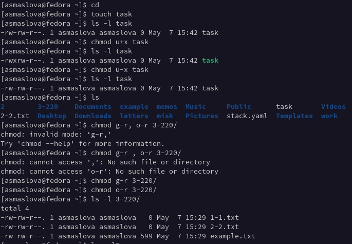
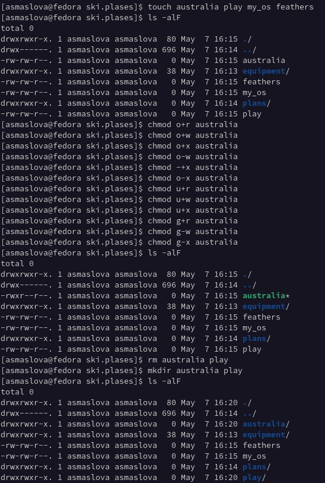
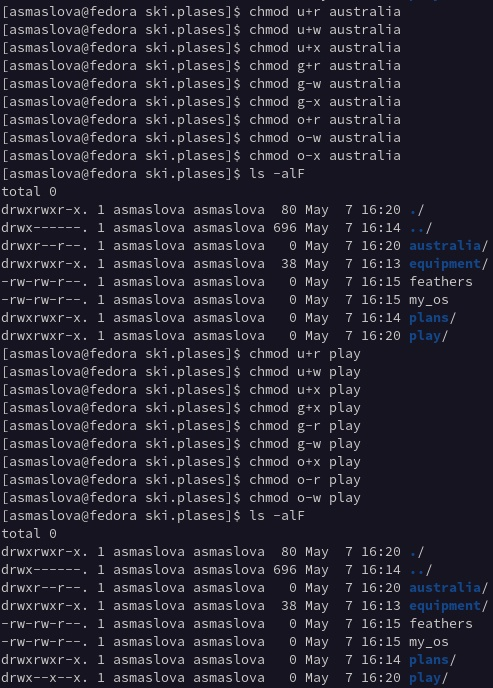
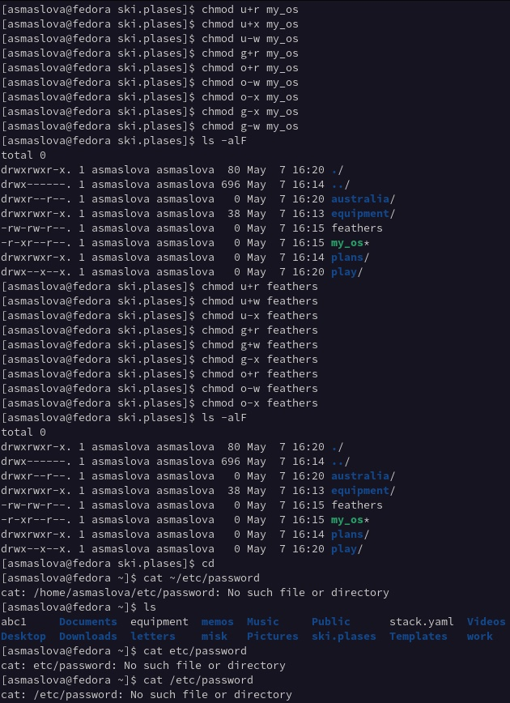
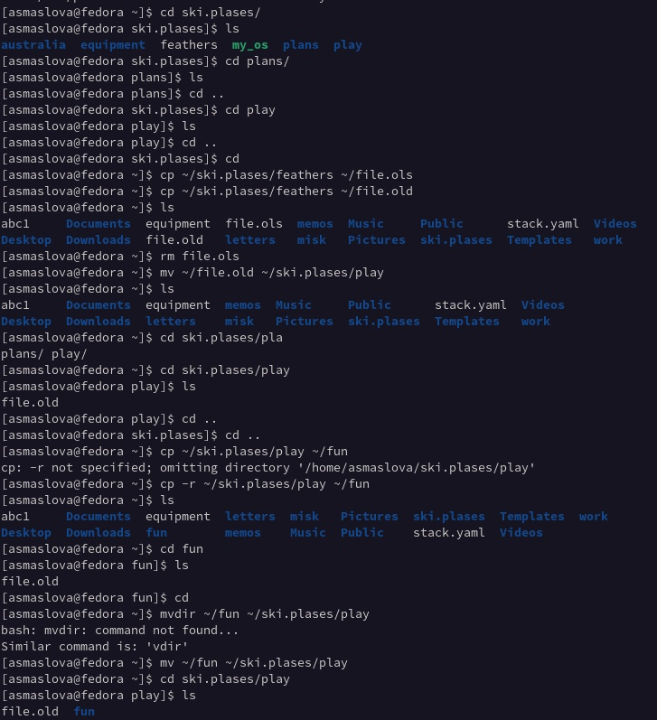
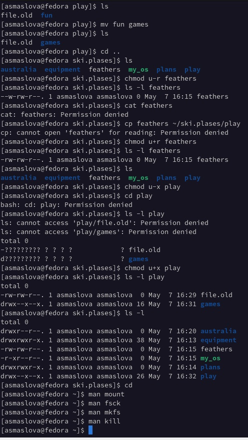
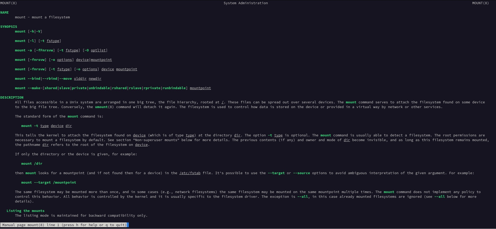
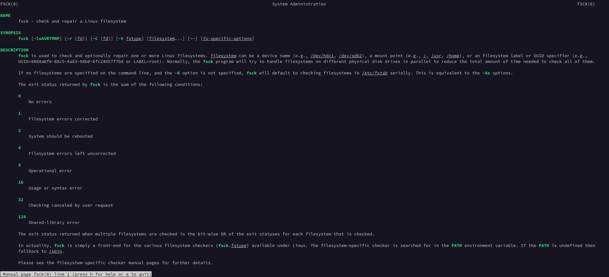
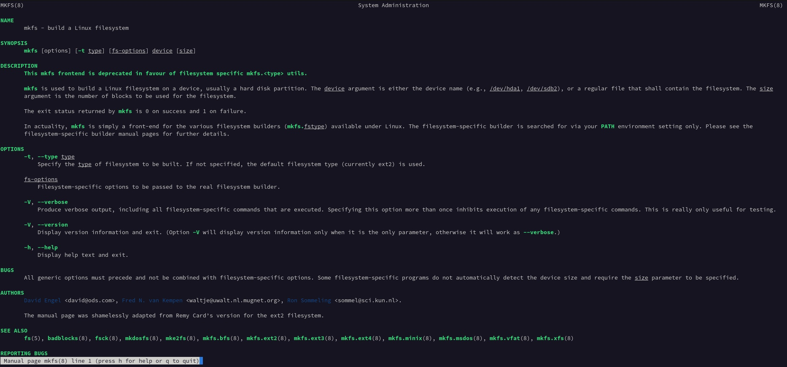
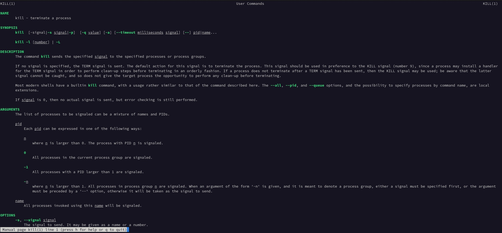

---
## Front matter
lang: ru-RU
title: Лабораторная работа №5
author: |
	Маслова Анастасия
	
institute: |
	RUDN University, Moscow, Russian Federation
	

## Formatting
toc: false
slide_level: 2
theme: metropolis
header-includes: 
 - \metroset{progressbar=frametitle,sectionpage=progressbar,numbering=fraction}
 - '\makeatletter'
 - '\beamer@ignorenonframefalse'
 - '\makeatother'
aspectratio: 43
section-titles: true
---

# Цель работы
Ознакомление с файловой системой Linux, её структурой, именами и содержанием каталогов. Приобретение практических навыков по применению команд для работы с файлами и каталогами, по управлению процессами (и работами), по проверке использования диска и обслуживанию файловой системы.

# Выполнение лабораторной работы

Сначала я выполнила все примеры, представленные в теоретическом введении лабораторной работы. Далее я создала файл equipment. В домашнем каталоге создала директорию ~/ski.plases, переместила файл equipment в каталог ~/ski.plases, переименовала файл ~/ski.plases/equipment в ~/ski.plases/equiplist. 

#
Далее я создала в домашнем каталоге файл abc1 и скопировала его в каталог ~/ski.plases, назвав его equiplist2, далее я создала каталог с именем equipment в каталоге ~/ski.plases, переместила файлы ~/ski.plases/equiplist и equiplist2 в каталог ~/ski.plases/equipment, создала и переместила каталог ~/newdir в каталог ~/ski.plases и назвала его plans. (рис.1)

#

#
Далее я создала каталоги australia, play и файлы my_os, feathers, над котороыми проводила указанные в задании манипуляции с правами доступа (рис.2-4)

#

# Выполнение лабораторной работы
Я просмотрела содержимое файла /etc/password, скопировала файл ~/feathers в файл ~/file.old, переместите файл ~/file.old в каталог ~/play, скопируйте каталог ~/play в каталог ~/fun, переместите каталог ~/fun в каталог ~/play и назовите его games. Далее я лишила владельца файла ~/feathers права на чтение и попробовала просмотреть файл ~/feathers командой cat, но у меня ничего не вышло, поскольку права на чтение ограничены. 

# 
Скопировать у меня не вышло по этой же причине. Далее я вернула владельцу файла ~/feathers право на чтение и лишила владельца каталога ~/play права на выполнение, после чего попыталась перейти в каталог ~/play, но не смогла из-за ограниченности прав. После этого я вернула права на выполнение владельцу (рис.5-6).

Далее я прочитала man по командам mount, fsck, mkfs, kill и кратко их охарактеризовала, приведя примеры (рис.6-10)

## Выводы

По итогам лабораторной работы я ознакомилась с файловой системой Linux, её структурой, именами и содержанием каталогов, а также на практике научилась применять команды для работы с файлами и каталогами, управлять процессами (и работами), проверять использование диска и обслуживать файловую систему.

