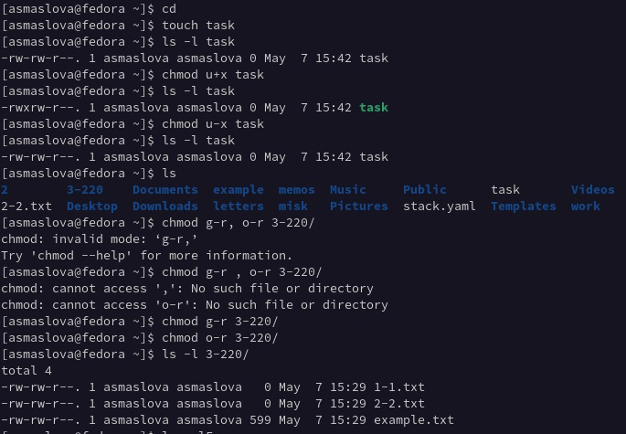
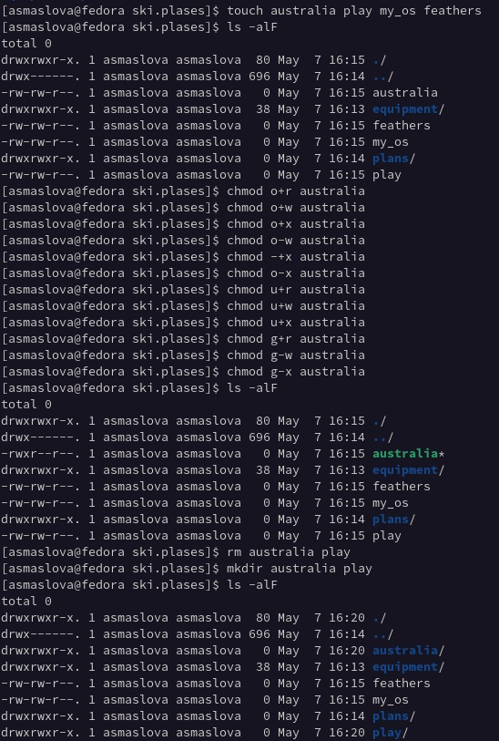
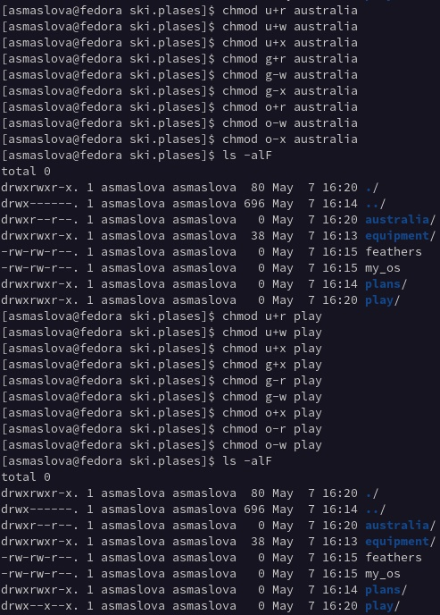
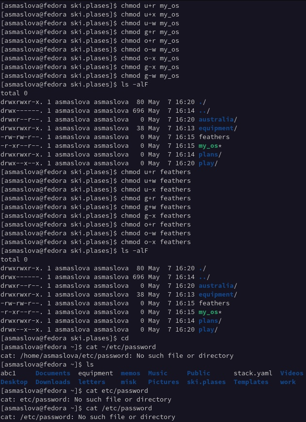
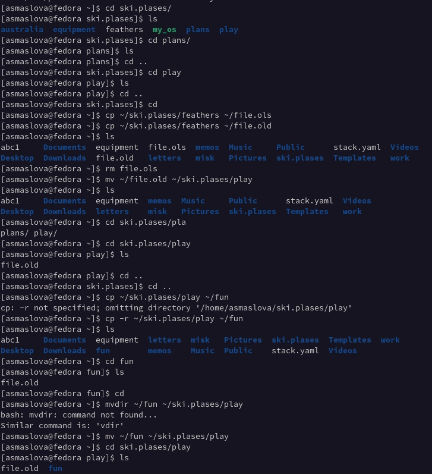
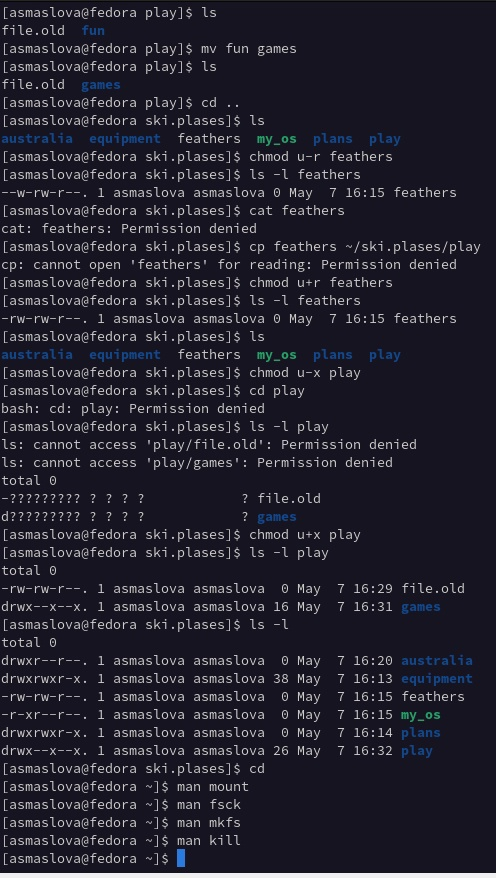
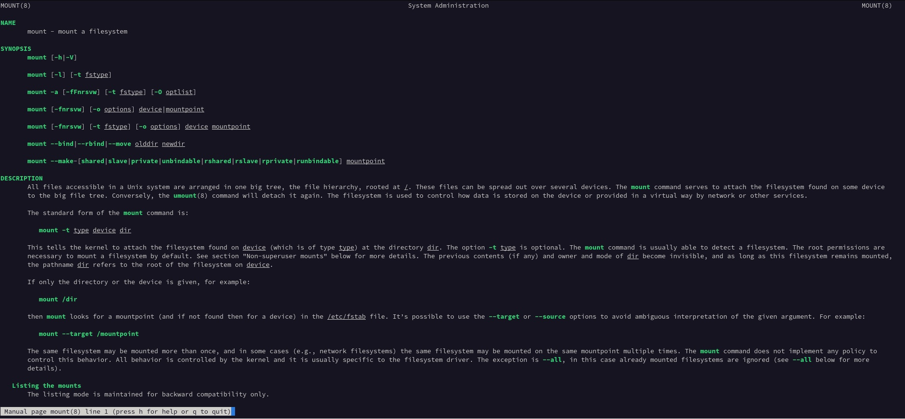
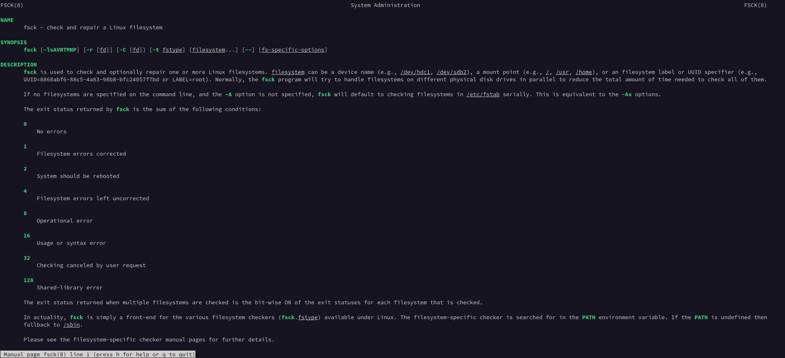
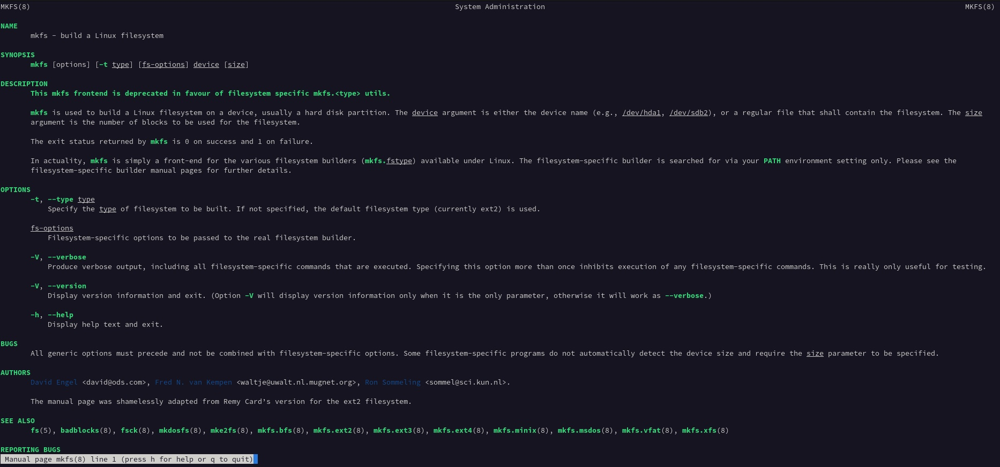
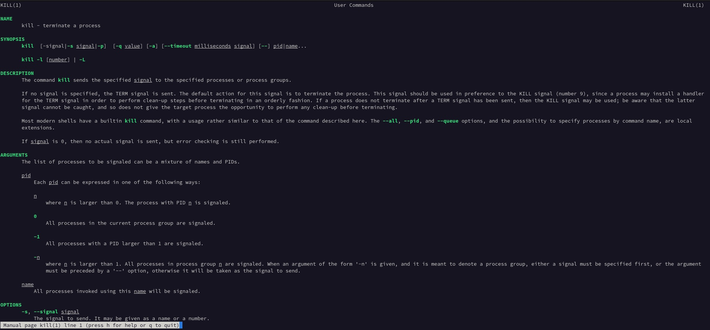

---
## Front matter
title: "Отчет к лабораторной работе №5"
subtitle: "Дисциплина: Операционные системы"
author: "Маслова Анастасия, НКНбд-01-21"

## Generic otions
lang: ru-RU
toc-title: "Содержание"

## Bibliography
bibliography: bib/cite.bib
csl: pandoc/csl/gost-r-7-0-5-2008-numeric.csl

## Pdf output format
toc: true # Table of contents
toc-depth: 2
lof: true # List of figures
lot: true # List of tables
fontsize: 12pt
linestretch: 1.5
papersize: a4
documentclass: scrreprt
## I18n polyglossia
polyglossia-lang:
  name: russian
  options:
	- spelling=modern
	- babelshorthands=true
polyglossia-otherlangs:
  name: english
## I18n babel
babel-lang: russian
babel-otherlangs: english
## Fonts
mainfont: PT Serif
romanfont: PT Serif
sansfont: PT Sans
monofont: PT Mono
mainfontoptions: Ligatures=TeX
romanfontoptions: Ligatures=TeX
sansfontoptions: Ligatures=TeX,Scale=MatchLowercase
monofontoptions: Scale=MatchLowercase,Scale=0.9
## Biblatex
biblatex: true
biblio-style: "gost-numeric"
biblatexoptions:
  - parentracker=true
  - backend=biber
  - hyperref=auto
  - language=auto
  - autolang=other*
  - citestyle=gost-numeric
## Pandoc-crossref LaTeX customization
figureTitle: "Рис."
tableTitle: "Таблица"
listingTitle: "Листинг"
lofTitle: "Список иллюстраций"
lotTitle: "Список таблиц"
lolTitle: "Листинги"
## Misc options
indent: true
header-includes:
  - \usepackage{indentfirst}
  - \usepackage{float} # keep figures where there are in the text
  - \floatplacement{figure}{H} # keep figures where there are in the text
---

# Цель работы

Ознакомление с файловой системой Linux, её структурой, именами и содержанием каталогов. Приобретение практических навыков по применению команд для работы с файлами и каталогами, по управлению процессами (и работами), по проверке использования диска и обслуживанию файловой системы.

# Задание

1. Выполните все примеры, приведённые в первой части описания лабораторной работы.
2. Выполните следующие действия, зафиксировав в отчёте по лабораторной работе используемые при этом команды и результаты их выполнения:
	2.1. Скопируйте файл /usr/include/sys/io.h в домашний каталог и назовите его equipment. Если файла io.h нет, то используйте любой другой файл в каталоге /usr/include/sys/ вместо него.
	2.2. В домашнем каталоге создайте директорию ~/ski.plases.
	2.3. Переместите файл equipment в каталог ~/ski.plases.
	2.4. Переименуйте файл ~/ski.plases/equipment в ~/ski.plases/equiplist.
	2.5. Создайте в домашнем каталоге файл abc1 и скопируйте его в каталог ~/ski.plases, назовите его equiplist2.
	2.6. Создайте каталог с именем equipment в каталоге ~/ski.plases.
	2.7. Переместите файлы ~/ski.plases/equiplist и equiplist2 в каталог ~/ski.plases/equipment.
	2.8. Создайте и переместите каталог ~/newdir в каталог ~/ski.plases и назовите его plans.
3. Определите опции команды chmod, необходимые для того, чтобы присвоить перечисленным ниже файлам выделенные права доступа, считая, что в начале таких прав нет:
	3.1. drwxr--r-- ... australia
	3.2. drwx--x--x ... play
	3.3. -r-xr--r-- ... my_os
	3.4. -rw-rw-r-- ... feathers
	При необходимости создайте нужные файлы.
4. Проделайте приведённые ниже упражнения, записывая в отчёт по лабораторной работе используемые при этом команды:
	4.1. Просмотрите содержимое файла /etc/password.
	4.2. Скопируйте файл ~/feathers в файл ~/file.old.
	4.3. Переместите файл ~/file.old в каталог ~/play.
	4.4. Скопируйте каталог ~/play в каталог ~/fun.
	4.5. Переместите каталог ~/fun в каталог ~/play и назовите его games.
	4.6. Лишите владельца файла ~/feathers права на чтение.
	4.7. Что произойдёт, если вы попытаетесь просмотреть файл ~/feathers командой cat?
	4.8. Что произойдёт, если вы попытаетесь скопировать файл ~/feathers?
	4.9. Дайте владельцу файла ~/feathers право на чтение.
	4.10. Лишите владельца каталога ~/play права на выполнение.
	4.11. Перейдите в каталог ~/play. Что произошло?
	4.12. Дайте владельцу каталога ~/play право на выполнение.
5. Прочитайте man по командам mount, fsck, mkfs, kill и кратко их охарактеризуйте, приведя примеры.

# Теоретическое введение

## Команды для работы с файлами и каталогами
Для создания текстового файла можно использовать команду touch. Формат команды:
```bash
touch имя-файла
```
Для просмотра файлов небольшого размера можно использовать команду cat. Формат команды:
```bash
cat имя-файла
```
Для просмотра файлов постранично удобнее использовать команду less. Формат команды:
```bash
less имя-файла
```
Следующие клавиши используются для управления процессом просмотра:
– Space — переход к следующей странице,
– ENTER — сдвиг вперёд на одну строку,
– b — возврат на предыдущую страницу,
– h — обращение за подсказкой,
– q — выход из режима просмотра файла.

Команда head выводит по умолчанию первые 10 строк файла. Формат команды:
```bash
head [-n] имя-файла,
```
где n — количество выводимых строк.

Команда tail выводит умолчанию 10 последних строк файла. Формат команды:
```bash
tail [-n] имя-файла,
```
где n — количество выводимых строк.

## Копирование файлов и каталогов

Команда cp используется для копирования файлов и каталогов. Формат команды:
```bash
cp [-опции] исходный_файл целевой_файл
```
Примеры:
1. Копирование файла в текущем каталоге. Скопировать файл ~/abc1 в файл april и в файл may:
```bash
cd
touch abc1
cp abc1 april
cp abc1 may
```
2. Копирование нескольких файлов в каталог. Скопировать файлы april и may в каталог monthly:
```bash
mkdir monthly
cp april may monthly
```
3. Копирование файлов в произвольном каталоге.Скопировать файл monthly/may в файл с именем june:
```bash
cp monthly/may monthly/june
ls monthly
```
Опция i в команде cp выведет на экран запрос подтверждения о перезаписи файла. Для рекурсивного копирования каталогов, содержащих файлы, используется команда cp с опцией r.
Примеры:
1. Копирование каталогов в текущем каталоге. Скопировать каталог monthly в каталог monthly.00:
```bash
mkdir monthly.00
cp -r monthly monthly.00
```
2. Копирование каталогов в произвольном каталоге. Скопировать каталог monthly.00
в каталог /tmp
```bash
cp -r monthly.00 /tmp
```
## Перемещение и переименование файлов и каталогов
Команды mv и mvdir предназначены для перемещения и переименования файлов и каталогов. Формат команды mv:
```bash
mv [-опции] старый_файл новый_файл
```
Примеры:
1. Переименование файлов в текущем каталоге. Изменить название файла april на july в домашнем каталоге:
```bash
cd
mv april july
```
2. Перемещение файлов в другой каталог. Переместить файл july в каталог monthly.00:
```bash
mv july monthly.00
ls monthly.00
```
Результат:
```bash
april july june may
```
Если необходим запрос подтверждения о перезаписи файла, то нужно использовать опцию i.

3. Переименование каталогов в текущем каталоге. Переименовать каталог monthly.00 в monthly.01
```bash
mv monthly.00 monthly.01
```
4. Перемещение каталога в другой каталог. Переместить каталог monthly.01 в каталог reports:
```bash
mkdir reports
mv monthly.01 reports
```
5. Переименование каталога, не являющегося текущим. Переименовать каталог reports/monthly.01 в reports/monthly:
```bash
mv reports/monthly.01 reports/monthly
```

Полное теоретическую справку смотреть [здесь](https://esystem.rudn.ru/pluginfile.php/1383175/mod_resource/content/4/005-lab_files.pdf)

# Выполнение лабораторной работы

1. Сначала я выполнила все примеры, представленные в теоретическом введении лабораторной работы.
2. Далее я создала файл equipment. В домашнем каталоге создала директорию ~/ski.plases, переместила файл equipment в каталог ~/ski.plases, переименовала файл ~/ski.plases/equipment в ~/ski.plases/equiplist, создала в домашнем каталоге файл abc1 и скопировала его в каталог ~/ski.plases, назвав его equiplist2, далее я создала каталог с именем equipment в каталоге ~/ski.plases, переместила файлы ~/ski.plases/equiplist и equiplist2 в каталог ~/ski.plases/equipment, создала и переместила каталог ~/newdir в каталог ~/ski.plases и назвала его plans. (рис.1)



3. Далее я создала каталоги australia, play и файлы my_os, feathers, над котороыми проводила указанные в задании манипуляции с правами доступа (рис.2-4)







4. Я просмотрела содержимое файла /etc/password, скопировала файл ~/feathers в файл ~/file.old, переместите файл ~/file.old в каталог ~/play, скопируйте каталог ~/play в каталог ~/fun, переместите каталог ~/fun в каталог ~/play и назовите его games. Далее я лишила владельца файла ~/feathers права на чтение и попробовала просмотреть файл ~/feathers командой cat, но у меня ничего не вышло, поскольку права на чтение ограничены. Скопировать у меня не вышло по этой же причине. Далее я вернула владельцу файла ~/feathers право на чтение и лишила владельца каталога ~/play права на выполнение, после чего попыталась перейти в каталог ~/play, но не смогла из-за ограниченности прав. После этого я вернула права на выполнение владельцу (рис.5-6).





5. Далее я прочитала man по командам mount, fsck, mkfs, kill и кратко их охарактеризовала, приведя примеры (рис.6-10)









# Выводы

По итогам лабораторной работы я ознакомилась с файловой системой Linux, её структурой, именами и содержанием каталогов, а также на практике научилась применять команды для работы с файлами и каталогами, управлять процессами (и работами), проверять использование диска и обслуживать файловую систему.

# Список литературы{.unnumbered}

::: {#refs}
:::
