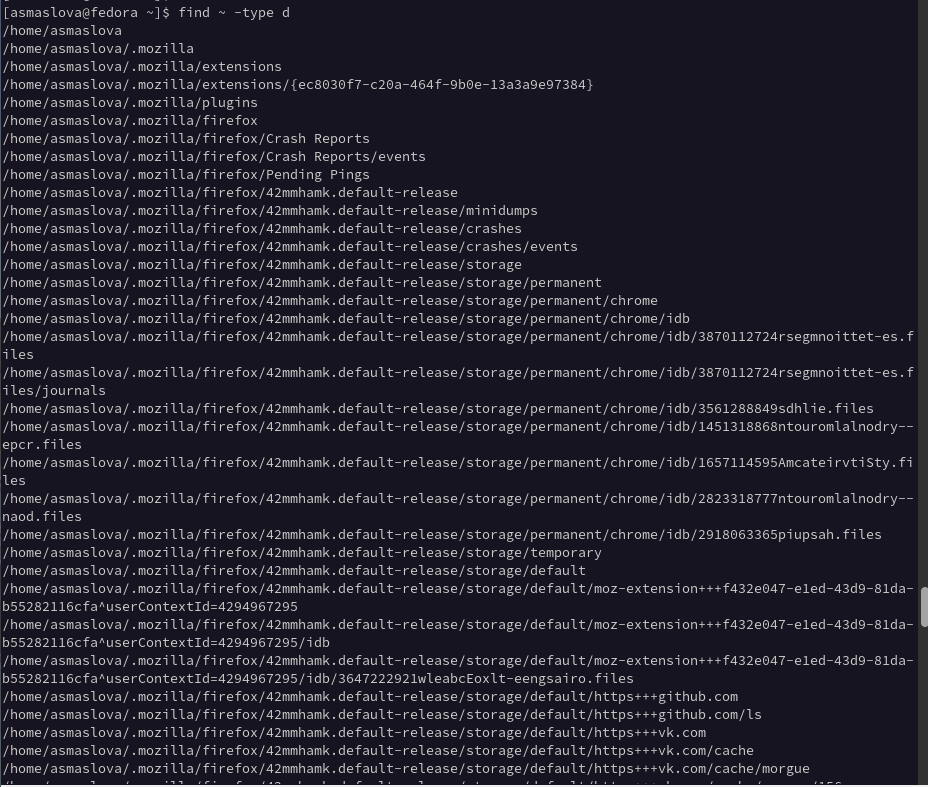

---
## Front matter
title: "Лабораторная работа №6"
subtitle: "Дисциплина: Операционные системы"
author: "Маслова Анастасия Сергеевна"

## Generic otions
lang: ru-RU
toc-title: "Содержание"

## Bibliography
bibliography: bib/cite.bib
csl: pandoc/csl/gost-r-7-0-5-2008-numeric.csl

## Pdf output format
toc: true # Table of contents
toc-depth: 2
lof: true # List of figures
lot: true # List of tables
fontsize: 12pt
linestretch: 1.5
papersize: a4
documentclass: scrreprt
## I18n polyglossia
polyglossia-lang:
  name: russian
  options:
	- spelling=modern
	- babelshorthands=true
polyglossia-otherlangs:
  name: english
## I18n babel
babel-lang: russian
babel-otherlangs: english
## Fonts
mainfont: PT Serif
romanfont: PT Serif
sansfont: PT Sans
monofont: PT Mono
mainfontoptions: Ligatures=TeX
romanfontoptions: Ligatures=TeX
sansfontoptions: Ligatures=TeX,Scale=MatchLowercase
monofontoptions: Scale=MatchLowercase,Scale=0.9
## Biblatex
biblatex: true
biblio-style: "gost-numeric"
biblatexoptions:
  - parentracker=true
  - backend=biber
  - hyperref=auto
  - language=auto
  - autolang=other*
  - citestyle=gost-numeric
## Pandoc-crossref LaTeX customization
figureTitle: "Рис."
tableTitle: "Таблица"
listingTitle: "Листинг"
lofTitle: "Список иллюстраций"
lotTitle: "Список таблиц"
lolTitle: "Листинги"
## Misc options
indent: true
header-includes:
  - \usepackage{indentfirst}
  - \usepackage{float} # keep figures where there are in the text
  - \floatplacement{figure}{H} # keep figures where there are in the text
---

# Цель работы

Ознакомление с инструментами поиска файлов и фильтрации текстовых данных. Приобретение практических навыков: по управлению процессами (и заданиями), по проверке использования диска и обслуживанию файловых систем.

# Задание

1. Осуществите вход в систему, используя соответствующее имя пользователя.
2. Запишите в файл file.txt названия файлов, содержащихся в каталоге /etc. Допишите в этот же файл названия файлов, содержащихся в вашем домашнем каталоге.
3. Выведите имена всех файлов из file.txt, имеющих расширение .conf, после чего запишите их в новый текстовой файл conf.txt.
4. Определите, какие файлы в вашем домашнем каталоге имеют имена, начинавшиеся с символа c? Предложите несколько вариантов, как это сделать.
5. Выведите на экран (по странично) имена файлов из каталога /etc, начинающиеся с символа h.
6. Запустите в фоновом режиме процесс, который будет записывать в файл ~/logfile файлы, имена которых начинаются с log.
7. Удалите файл ~/logfile.
8. Запустите из консоли в фоновом режиме редактор gedit.
9. Определите идентификатор процесса gedit, используя команду ps, конвейер и фильтр grep. Как ещё можно определить идентификатор процесса?
10. Прочтите справку (man) команды kill, после чего используйте её для завершения процесса gedit.
11. Выполните команды df и du, предварительно получив более подробную информацию об этих командах, с помощью команды man.
12. Воспользовавшись справкой команды find, выведите имена всех директорий, имеющихся в вашем домашнем каталоге.

# Теоретическое введение

В системе по умолчанию открыто три специальных потока:
- stdin — стандартный поток ввода (по умолчанию: клавиатура), файловый дескриптор 0;
- stdout — стандартный поток вывода (по умолчанию: консоль), файловый дескриптор 1;
- stderr — стандартный поток вывод сообщений об ошибках (по умолчанию: консоль), файловый дескриптор 2.
Большинство используемых в консоли команд и программ записывают результаты своей работы в стандартный поток вывода stdout. Например, команда ls выводит в стандартный поток вывода (консоль) список файлов в текущей директории. Потоки вывода и ввода можно перенаправлять на другие файлы или устройства. Проще всего это делается с помощью символов >, >>, <, <<.

Более подробная теория - [здесь](https://esystem.rudn.ru/pluginfile.php/1383177/mod_resource/content/4/006-lab_proc.pdf)

# Выполнение лабораторной работы

1. Сначала я осуществила вход в систему, используя свое имя пользователя.
2. Далее я записала в файл file.txt названия файлов, содержащихся в каталоге /etc, после чего дописала в этот же файл названия файлов, содержащихся в моем домашнем каталоге (рис.1).

{ #fig:001 width=70% }

3. После этого я вывела имена всех файлов из file.txt, имеющих расширение .conf, и записала их в новый текстовой файл conf.txt (рис.2).

{ #fig:001 width=70% }

4. С помощью команды find я определила, какие файлы в моем домашнем каталоге имеют название, начинающееся с "с" (рис.3).

{ #fig:001 width=70% }

5. С помощью команды find я вывела на экран имена файлов из каталога /etc, начинающиеся с символа h (рис.4).

{ #fig:001 width=70% }

6. С помощью команды find и перенаправления ввода-вывода я запустила в фоновом режиме процесс, который будет записывать в файл ~/logfile файлы, имена которых начинаются с log (рис.5).

{ #fig:001 width=70% }

7. Далее я удалила файл ~/logfile (рис.6).

{ #fig:001 width=70% }

8. С помощью знака амперсанта я запустила из консоли в фоновом режиме редактор gedit (рис.7).

{ #fig:001 width=70% }

9. Далее я определила идентификатор процесса gedit, используя команду ps, конвейер и фильтр grep (рис.7).
10. После этого я прочла справку (man) команды kill и использоавала её для завершения процесса gedit (рис.7).
11. Далее я выполнила команды df и du, предварительно получив более подробную информацию об этих командах с помощью команды man (рис.8).

{ #fig:001 width=70% }

12. Воспользовавшись справкой команды find, я вывела имена всех директорий, имеющихся в моем домашнем каталоге (рис.9).

{ #fig:001 width=70% }

# Выводы

В ходе работы я ознакомилась с инструментами поиска файлов и фильтрации текстовых данных и приобрела практические навыки: по управлению процессами (и заданиями), по проверке использования диска и обслуживанию файловых систем.

# Список литературы{.unnumbered}

::: {#refs}
:::
