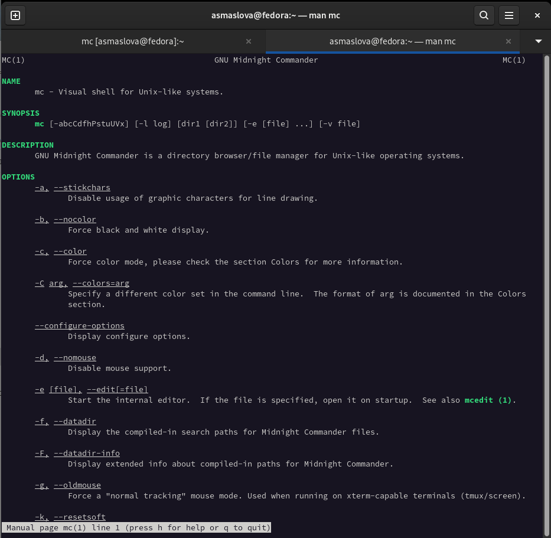
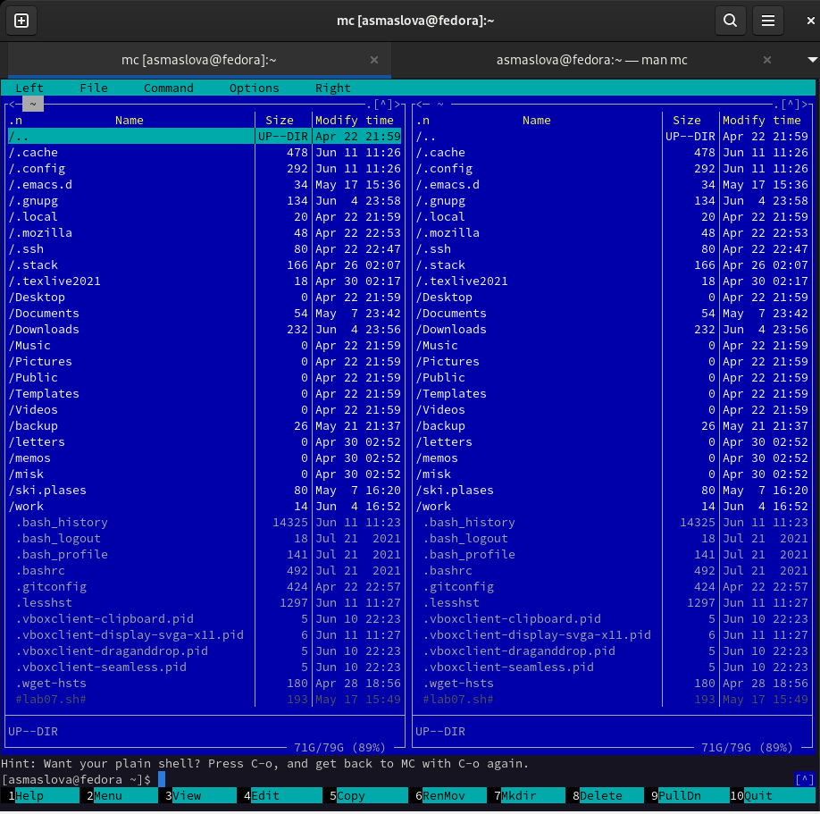
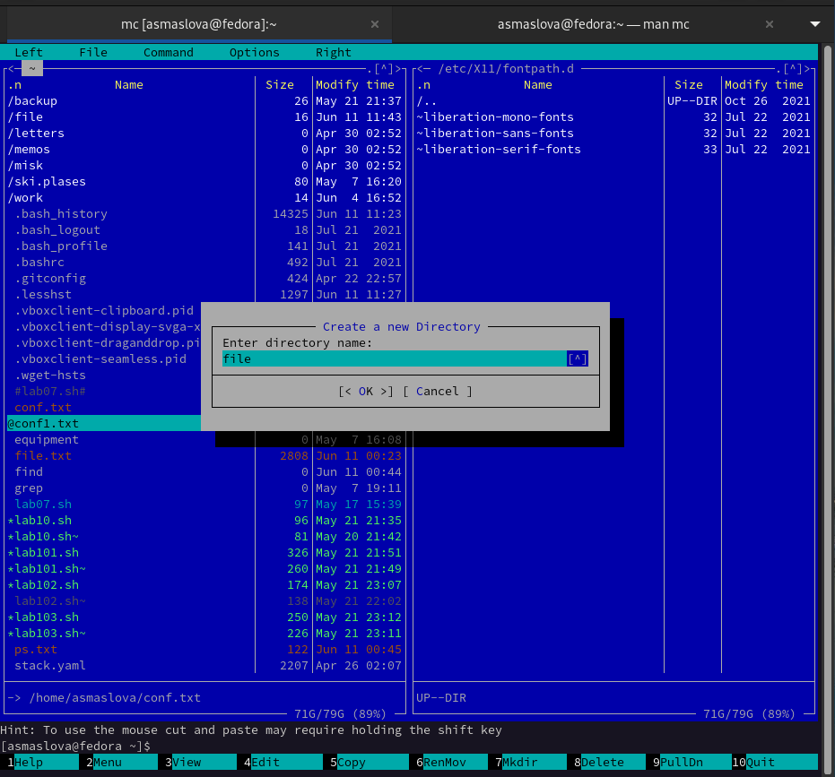
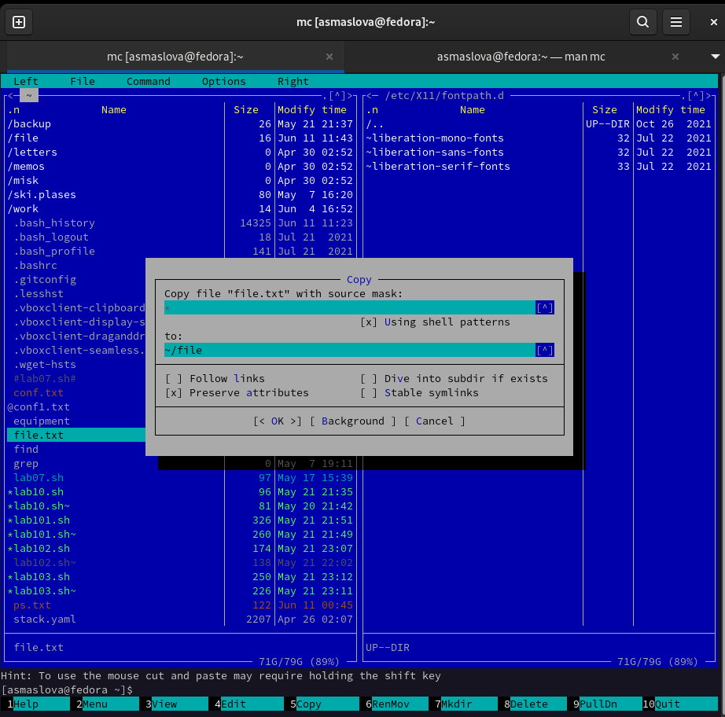
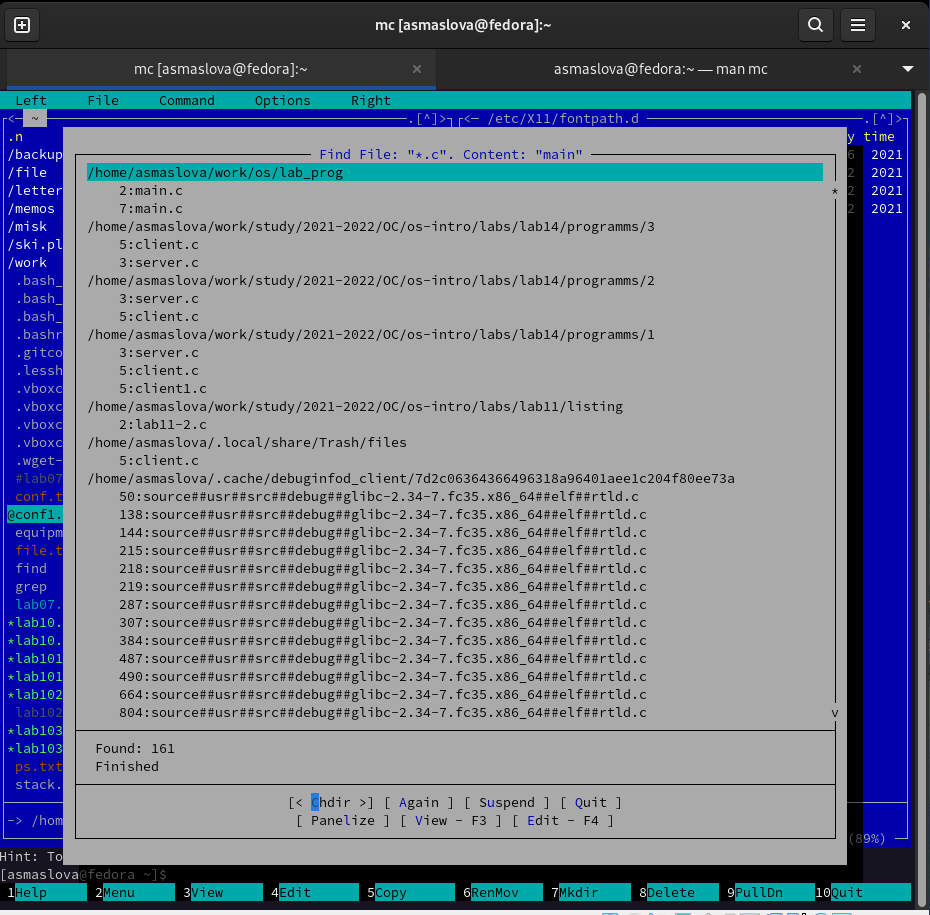
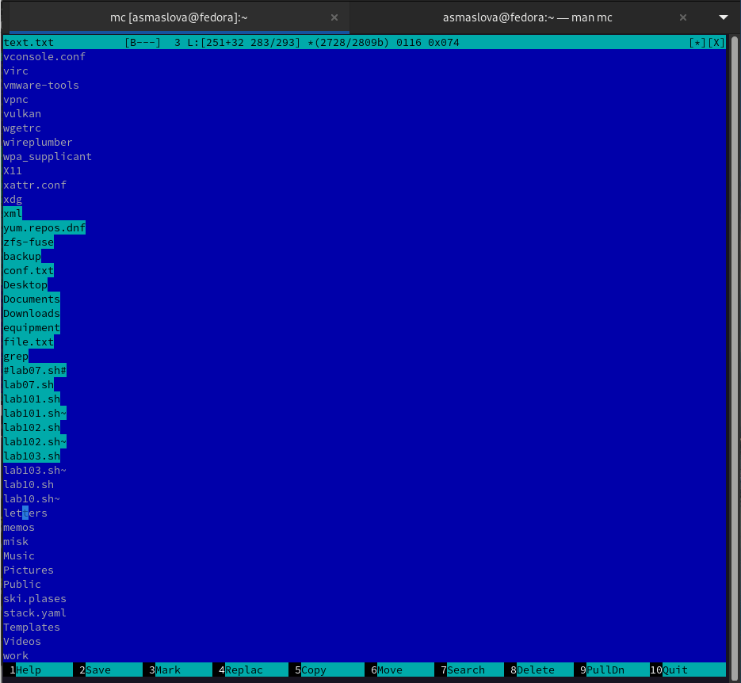
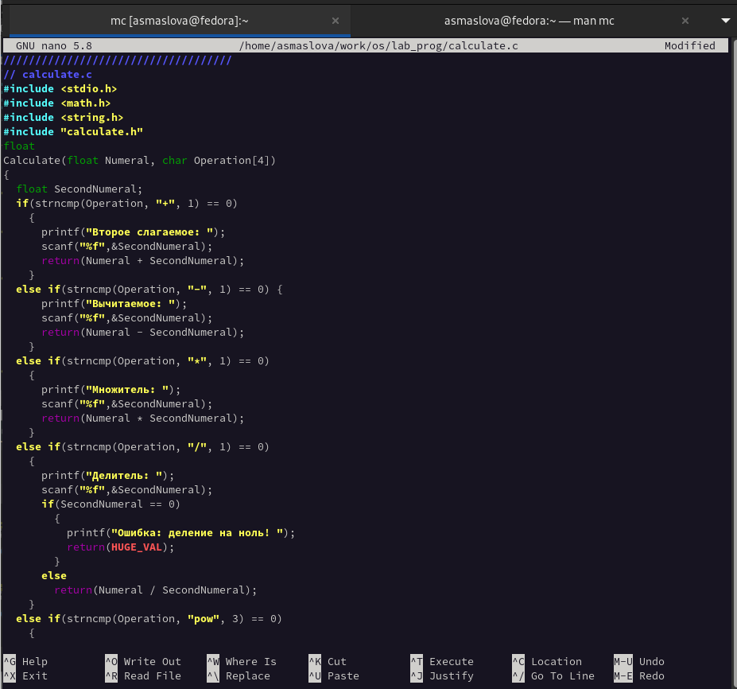

---
## Front matter
lang: ru-RU
title: Лабораторная работа №7
author: |
	Маслова Анастасия Сергеевна\inst{1}
	
institute: |
	\inst{1}RUDN University, Moscow, Russian Federation
	
date: NEC--2019, 30 September -- 4 October, 2019 Budva, Montenegro

## Formatting
toc: false
slide_level: 2
theme: metropolis
header-includes: 
 - \metroset{progressbar=frametitle,sectionpage=progressbar,numbering=fraction}
 - '\makeatletter'
 - '\beamer@ignorenonframefalse'
 - '\makeatother'
aspectratio: 43
section-titles: true
---

# Цель работы

Освоение основных возможностей командной оболочки Midnight Commander. Приобретение навыков практической работы по просмотру каталогов и файлов; манипуляций с ними.

# Выполнение лабораторной работы

1. Сначала я изучила информацию о mc, вызвав в командной строке man mc, затем запустила из командной строки mc, изучите его структуру и меню и выполнила несколько операций в mc, используя управляющие клавиши (операции с панелями; выделение/отмена выделения файлов, копирование/перемещение файлов, получение информации о размере и правах доступа на файлы и/или каталоги и т.п.) (рис.1). После этого я выполнила основные команды меню левой (или правой) панели и оценила степень подробности вывода информации о файлах (рис.2).

#

{ #fig:001 width=70% }

#

{ #fig:001 width=70% }

#

2. Используя возможности подменю Файл, я просмотрела содержимое текстового файла, отредактировала содержимое текстового файла (без сохранения результатов редактирования), создала каталог (рис.3) и скопировала файлы в созданный каталог (рис.4).

#

{ #fig:001 width=70% }

#

{ #fig:001 width=70% }

#

3. С помощью соответствующих средств подменю Команда я осуществила поиск в файловой системе файла с заданными условиями (например, файла с расширением .c или .cpp, содержащего строку main) (рис.5), выбор и повторение одной из предыдущих команд, переход в домашний каталог, анализ файла меню и файла расширений.

#

{ #fig:001 width=70% }

#

4. Далее я вызвала подменю Настройки и освоила операции, определяющие структуру экрана mc (Full screen, Double Width, Show Hidden Files и т.д.).

#

5. Далее я создала текстовой файл text.txt, открыла этот файл с помощью встроенного в mc редактора, вставила в открытый файл небольшой фрагмент текста, скопированный из любого другого файла или Интернета и проделала с текстом следующие манипуляции, используя горячие клавиши (рис.6):

#

	5.1. Удалила строку текста.
	5.2. Выделила фрагмент текста и скопировала его на новую строку.
	5.3. Выделила фрагмент текста и перенесла его на новую строку.
	5.4. Сохранила файл.
	5.5. Отменила последнее действие.
	5.6. Перешла в конец файла (нажав комбинацию клавиш) и написала некоторый текст.
	5.7. Перешла в начало файла (нажав комбинацию клавиш) и написала некоторый текст.
	5.8. Сохранила и закрыла файл.

#

{ #fig:001 width=70% }

#

6. После этого я открыла файл с исходным текстом на некотором языке программирования (например C или Java) и, используя меню редактора, включила подсветку синтаксиса (рис.7).

#

{ #fig:001 width=70% }

# Выводы

В ходе лабораторной работы я освоила основные возможности командной оболочки Midnight Commander и приобрела навыки практической работы по просмотру каталогов и файлов, манипуляций с ними.
