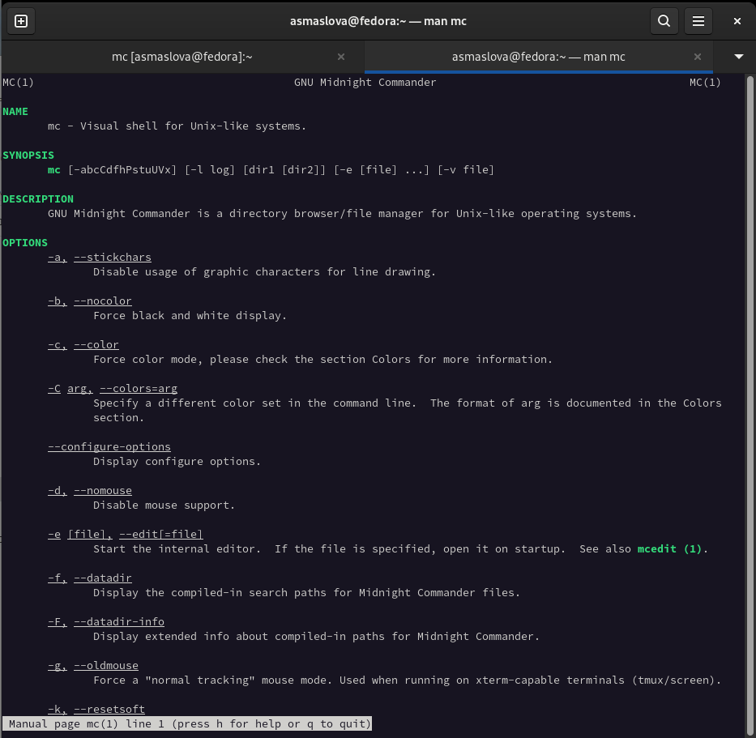
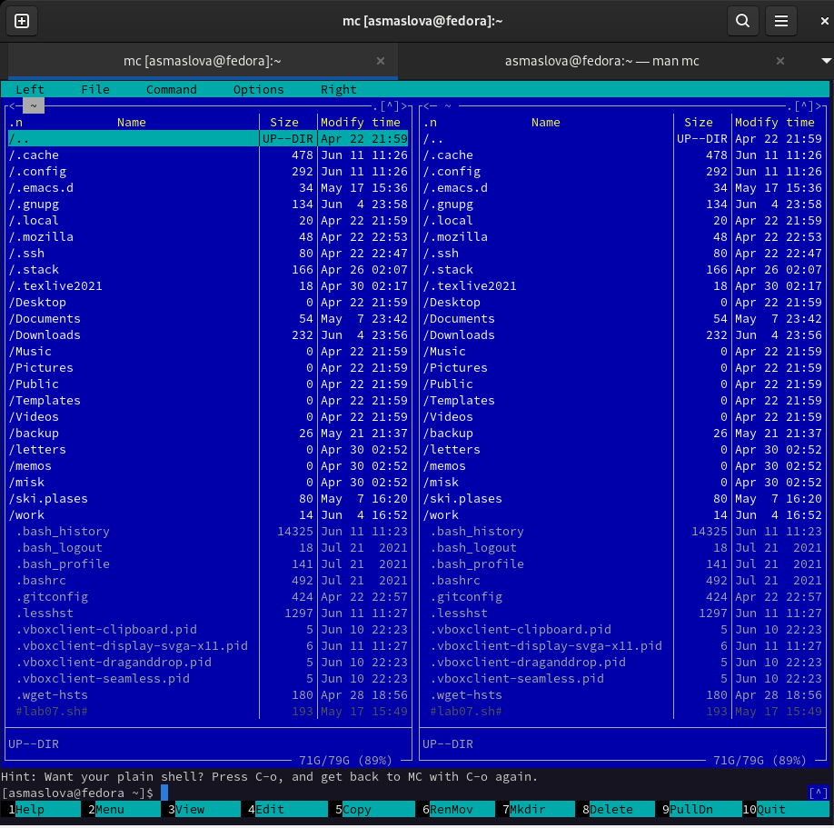
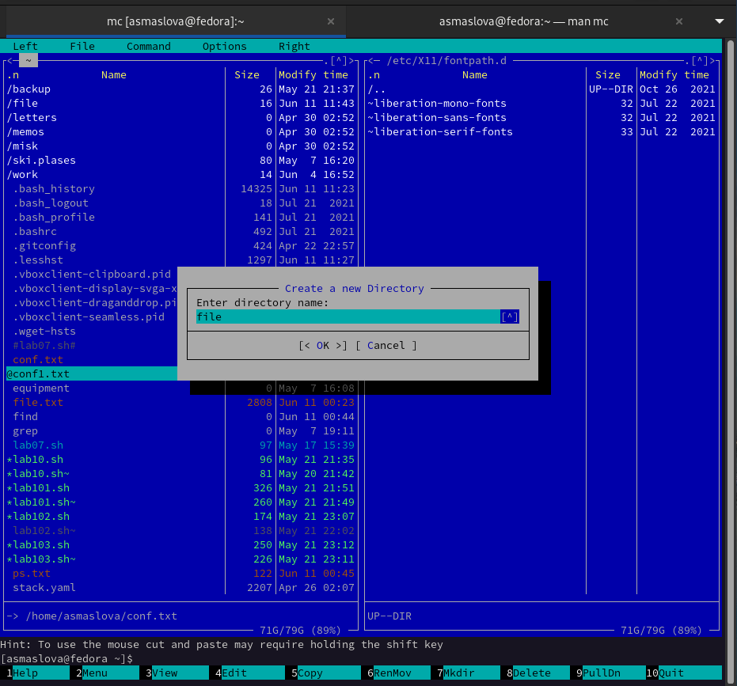
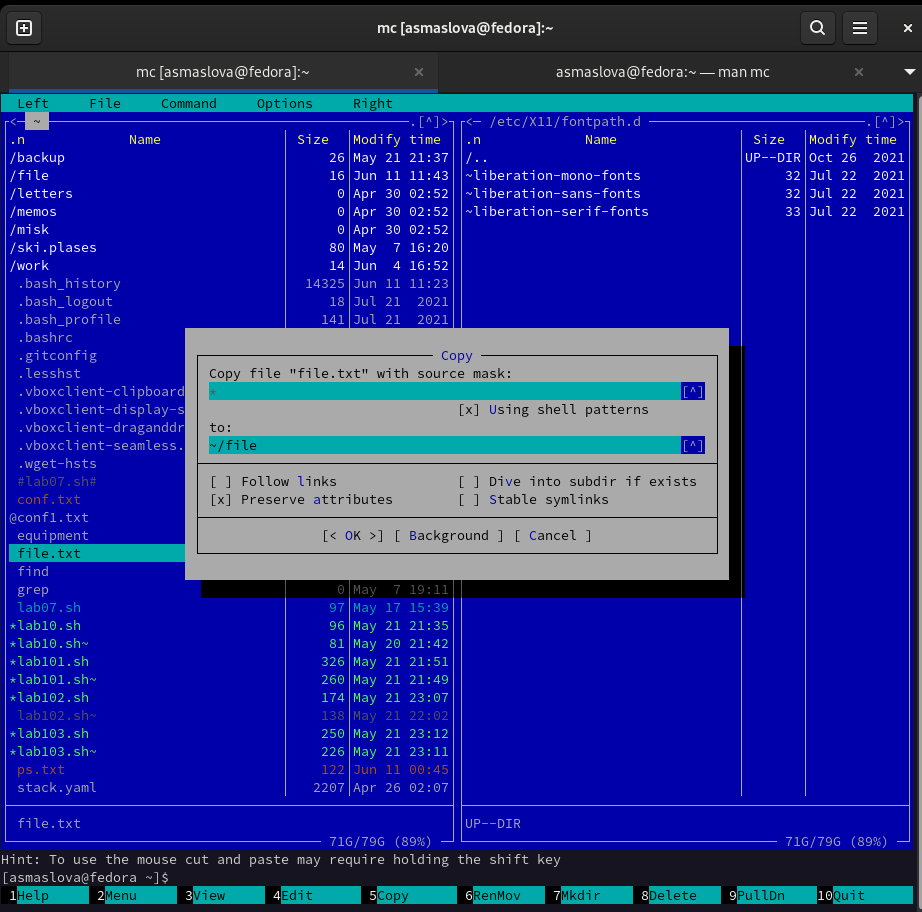
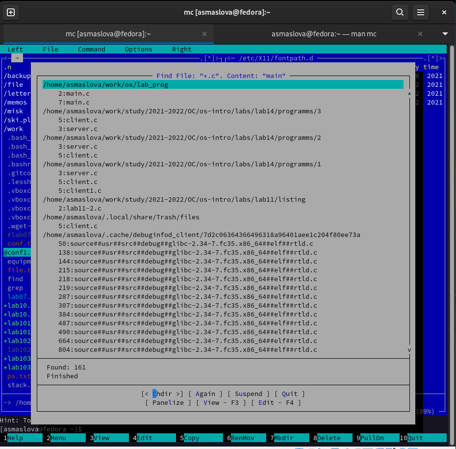
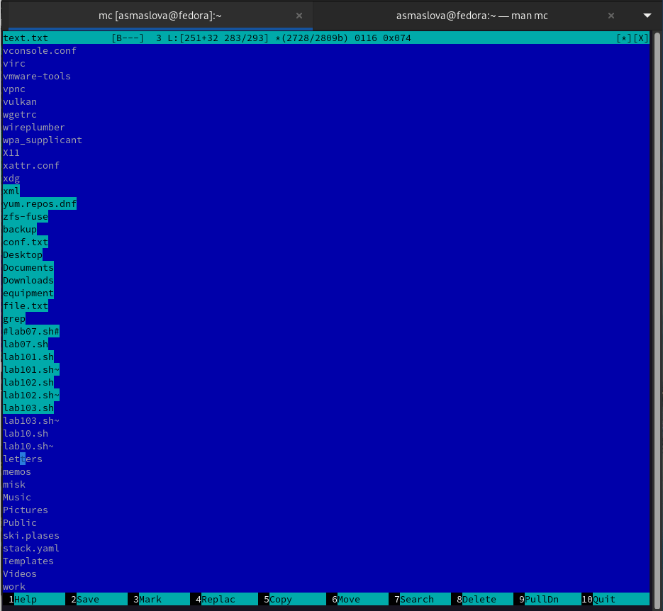
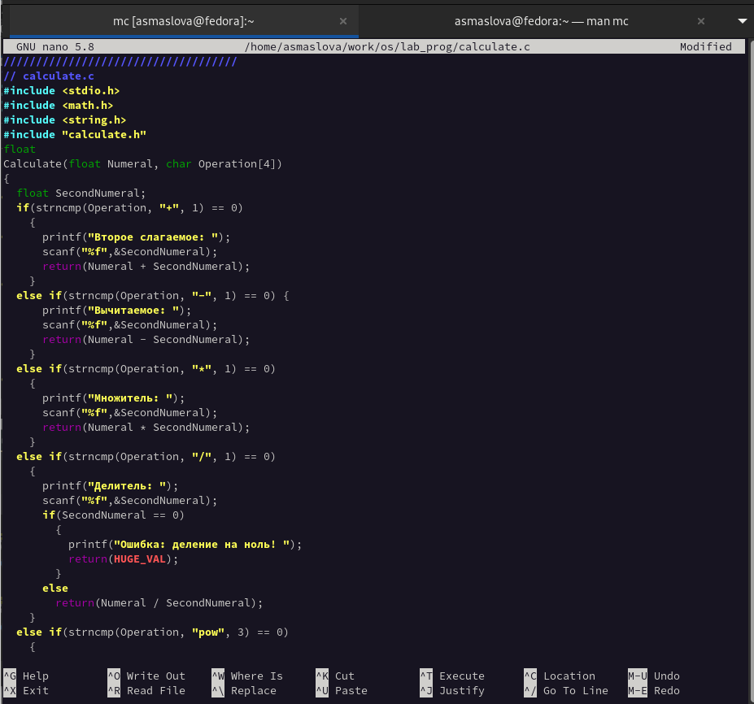

---
## Front matter
title: "Лабораторная работа №7"
subtitle: "Дисциплина: Операционные системы"
author: "Маслова Анастасия Сергеевна"

## Generic otions
lang: ru-RU
toc-title: "Содержание"

## Bibliography
bibliography: bib/cite.bib
csl: pandoc/csl/gost-r-7-0-5-2008-numeric.csl

## Pdf output format
toc: true # Table of contents
toc-depth: 2
lof: true # List of figures
lot: true # List of tables
fontsize: 12pt
linestretch: 1.5
papersize: a4
documentclass: scrreprt
## I18n polyglossia
polyglossia-lang:
  name: russian
  options:
	- spelling=modern
	- babelshorthands=true
polyglossia-otherlangs:
  name: english
## I18n babel
babel-lang: russian
babel-otherlangs: english
## Fonts
mainfont: PT Serif
romanfont: PT Serif
sansfont: PT Sans
monofont: PT Mono
mainfontoptions: Ligatures=TeX
romanfontoptions: Ligatures=TeX
sansfontoptions: Ligatures=TeX,Scale=MatchLowercase
monofontoptions: Scale=MatchLowercase,Scale=0.9
## Biblatex
biblatex: true
biblio-style: "gost-numeric"
biblatexoptions:
  - parentracker=true
  - backend=biber
  - hyperref=auto
  - language=auto
  - autolang=other*
  - citestyle=gost-numeric
## Pandoc-crossref LaTeX customization
figureTitle: "Рис."
tableTitle: "Таблица"
listingTitle: "Листинг"
lofTitle: "Список иллюстраций"
lotTitle: "Список таблиц"
lolTitle: "Листинги"
## Misc options
indent: true
header-includes:
  - \usepackage{indentfirst}
  - \usepackage{float} # keep figures where there are in the text
  - \floatplacement{figure}{H} # keep figures where there are in the text
---

# Цель работы

Освоение основных возможностей командной оболочки Midnight Commander. Приобретение навыков практической работы по просмотру каталогов и файлов; манипуляций с ними.

# Задание

## Задание по mc

1. Изучите информацию о mc, вызвав в командной строке man mc.
2. Запустите из командной строки mc, изучите его структуру и меню.
3. Выполните несколько операций в mc, используя управляющие клавиши (операции с панелями; выделение/отмена выделения файлов, копирование/перемещение файлов, получение информации о размере и правах доступа на файлы и/или каталоги и т.п.)
4. Выполните основные команды меню левой (или правой) панели. Оцените степень подробности вывода информации о файлах.
5. Используя возможности подменю Файл , выполните:
- просмотр содержимого текстового файла;
- редактирование содержимого текстового файла (без сохранения результатов редактирования);
- создание каталога;
– копирование в файлов в созданный каталог.
6. С помощью соответствующих средств подменю Команда осуществите:
- поиск в файловой системе файла с заданными условиями (например, файла с расширением .c или .cpp, содержащего строку main);
- выбор и повторение одной из предыдущих команд;
- переход в домашний каталог;
- анализ файла меню и файла расширений.
7. Вызовите подменю Настройки . Освойте операции, определяющие структуру экрана mc (Full screen, Double Width, Show Hidden Files и т.д.).

## Задание по встроенному редактору mc

1. Создайте текстовой файл text.txt.
2. Откройте этот файл с помощью встроенного в mc редактора.
3. Вставьте в открытый файл небольшой фрагмент текста, скопированный из любого другого файла или Интернета.
4. Проделайте с текстом следующие манипуляции, используя горячие клавиши:
4.1. Удалите строку текста.
4.2. Выделите фрагмент текста и скопируйте его на новую строку.
4.3. Выделите фрагмент текста и перенесите его на новую строку.
4.4. Сохраните файл.
4.5. Отмените последнее действие.
4.6. Перейдите в конец файла (нажав комбинацию клавиш) и напишите некоторый текст.
4.7. Перейдите в начало файла (нажав комбинацию клавиш) и напишите некоторый текст.
4.8. Сохраните и закройте файл.
5. Откройте файл с исходным текстом на некотором языке программирования (например C или Java)
6. Используя меню редактора, включите подсветку синтаксиса, если она не включена, или выключите, если она включена.

# Теоретическое введение

Командная оболочка — интерфейс взаимодействия пользователя с операционной системой и программным обеспечением посредством команд.
Midnight Commander (или mc) — псевдографическая командная оболочка для UNIX/Linux систем. Для запуска mc необходимо в командной строке набрать mc и нажать Enter.

Более подробно можно узнать [здесь](https://esystem.rudn.ru/pluginfile.php/1383179/mod_resource/content/5/007-lab_mc.pdf)

# Выполнение лабораторной работы

1. Сначала я изучила информацию о mc, вызвав в командной строке man mc, затем запустила из командной строки mc, изучите его структуру и меню и выполнила несколько операций в mc, используя управляющие клавиши (операции с панелями; выделение/отмена выделения файлов, копирование/перемещение файлов, получение информации о размере и правах доступа на файлы и/или каталоги и т.п.) (рис.1). После этого я выполнила основные команды меню левой (или правой) панели и оценила степень подробности вывода информации о файлах (рис.2).

{ #fig:001 width=70% }

{ #fig:001 width=70% }

2. Используя возможности подменю Файл, я просмотрела содержимое текстового файла, отредактировала содержимое текстового файла (без сохранения результатов редактирования), создала каталог (рис.3) и скопировала файлы в созданный каталог (рис.4).

{ #fig:001 width=70% }

{ #fig:001 width=70% }

3. С помощью соответствующих средств подменю Команда я осуществила поиск в файловой системе файла с заданными условиями (например, файла с расширением .c или .cpp, содержащего строку main) (рис.5), выбор и повторение одной из предыдущих команд, переход в домашний каталог, анализ файла меню и файла расширений.

{ #fig:001 width=70% }

4. Далее я вызвала подменю Настройки и освоила операции, определяющие структуру экрана mc (Full screen, Double Width, Show Hidden Files и т.д.).
5. Далее я создала текстовой файл text.txt, открыла этот файл с помощью встроенного в mc редактора, вставила в открытый файл небольшой фрагмент текста, скопированный из любого другого файла или Интернета и проделала с текстом следующие манипуляции, используя горячие клавиши (рис.6):
5.1. Удалила строку текста.
5.2. Выделила фрагмент текста и скопировала его на новую строку.
5.3. Выделила фрагмент текста и перенесла его на новую строку.
5.4. Сохранила файл.
5.5. Отменила последнее действие.
5.6. Перешла в конец файла (нажав комбинацию клавиш) и написала некоторый текст.
5.7. Перешла в начало файла (нажав комбинацию клавиш) и написала некоторый текст.
5.8. Сохранила и закрыла файл.

{ #fig:001 width=70% }

6. После этого я открыла файл с исходным текстом на некотором языке программирования (например C или Java) и, используя меню редактора, включила подсветку синтаксиса (рис.7).

{ #fig:001 width=70% }

# Выводы

В ходе лабораторной работы я освоила основные возможности командной оболочки Midnight Commander и приобрела навыки практической работы по просмотру каталогов и файлов, манипуляций с ними.

# Список литературы{.unnumbered}

::: {#refs}
:::
