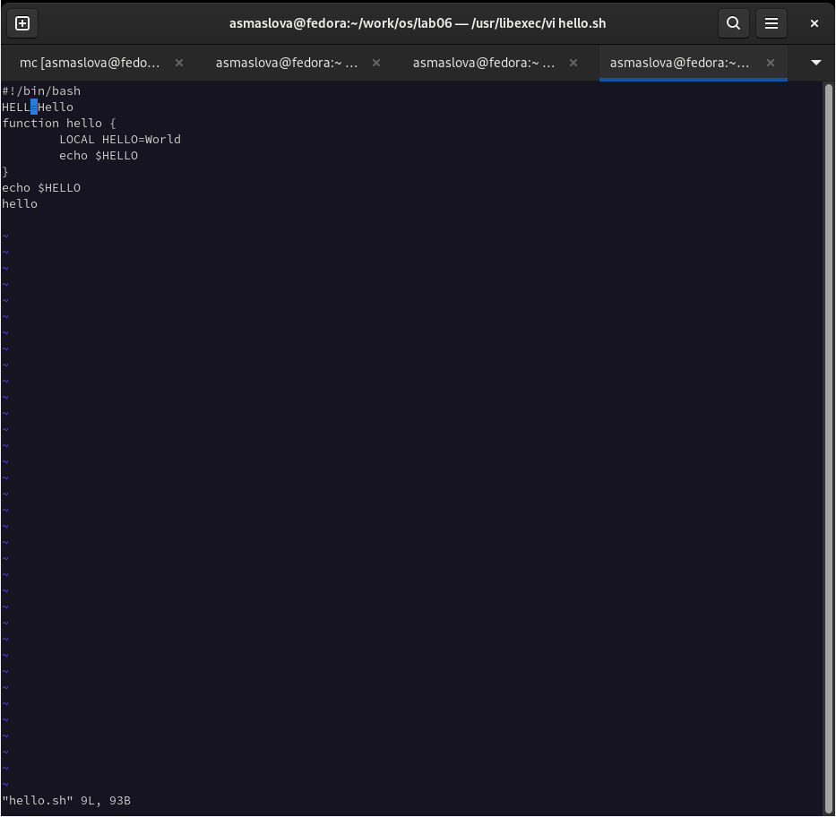
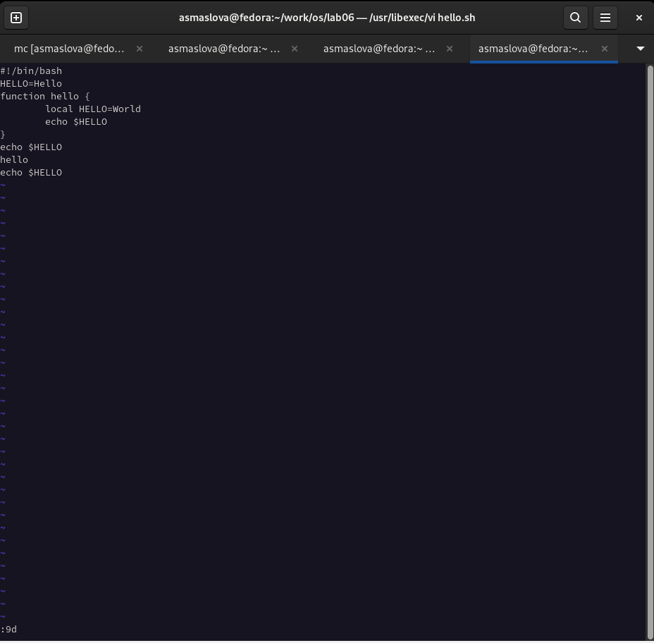
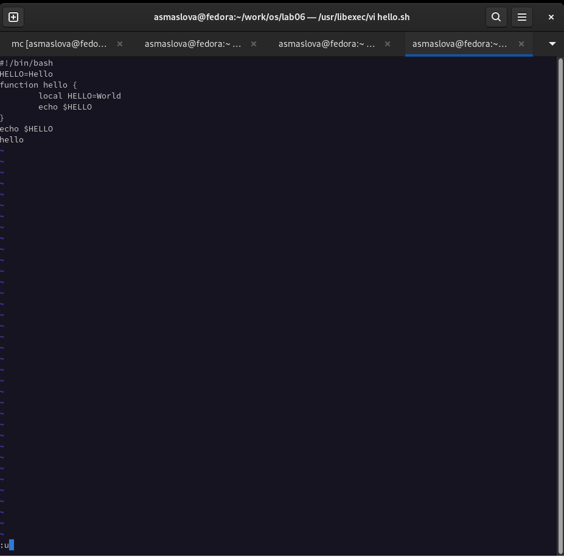
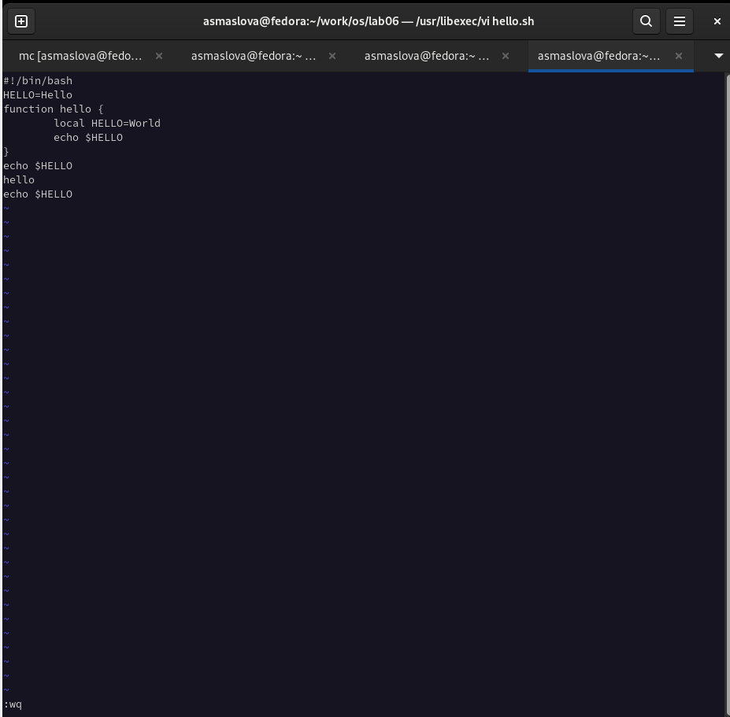

---
## Front matter
lang: ru-RU
title: Лабораторная работа №8
author: |
	Маслова Анастасия Сергеевна\inst{1}
institute: |
	\inst{1}RUDN University, Moscow, Russian Federation

## Formatting
toc: false
slide_level: 2
theme: metropolis
header-includes: 
 - \metroset{progressbar=frametitle,sectionpage=progressbar,numbering=fraction}
 - '\makeatletter'
 - '\beamer@ignorenonframefalse'
 - '\makeatother'
aspectratio: 43
section-titles: true
---

# Цель работы

Познакомиться с операционной системой Linux. Получить практические навыки работы с редактором vi, установленным по умолчанию практически во всех дистрибутивах.

# Выполнение лабораторной работы

1. Я создала каталог с именем ~/work/os/lab06, перешла во вновь созданный каталог, вызвала vi и создала файл hello.sh.
```bash
vi hello.sh
```

#

2. Далее я нажала клавишу i и ввела следующий текст (рис.1):
```bash
#!/bin/bash
HELL=Hello
function hello {
LOCAL HELLO=World
echo $HELLO
}
echo $HELLO
hello
```

#

{ #fig:001 width=70% }

#

3. После этого я нажала клавишу Esc для перехода в командный режим после завершения ввода текста.
4. Затем я нажала : для перехода в режим последней строки, и внизу моего экрана появилось приглашение в виде двоеточия, после чего я нажала w (записать) и q (выйти), а затем нажала клавишу Enter для сохранения моего текста и завершения работы.
5. После этого я сделала файл исполняемым с помощью chmod:
```bash
chmod +x hello.sh
```

#

6. Далее я вызвала vi на редактирование файла:
```bash
vi ~/work/os/lab06/hello.sh
```

#
7. Я установила курсор в конец слова HELL второй строки, перешла в режим вставки и заменила на HELLO, после чего нажала Esc для возврата в командный режим, установила курсор на четвертую строку и стерла слово LOCAL.

#
8. После этого я перешла в режим вставки и набрала следующий текст: local, нажала Esc для возврата в командный режим, установила курсор на последней строке файла, вставила после неё строку, содержащую следующий текст: echo $HELLO, нажала Esc для перехода в командный режим, удалила последнюю строку (рис.2), ввела команду отмены изменений u для отмены последней команды (рис.3), ввела символ : для перехода в режим последней строки, записала произведённые изменения и вышла из vi (рис.4).

#
{ #fig:001 width=70% }

#
{ #fig:001 width=70% }

#
{ #fig:001 width=70% }

# Выводы

В ходе лабораторной работы я познакомилась с операционной системой Linux и получила практические навыки работы с редактором vi, установленным по умолчанию практически во всех дистрибутивах.
