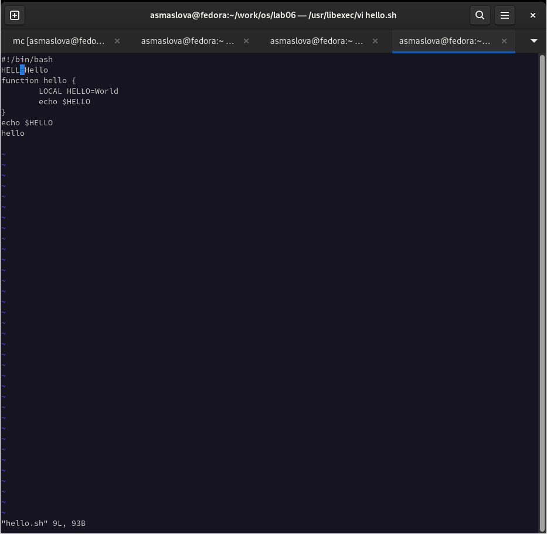
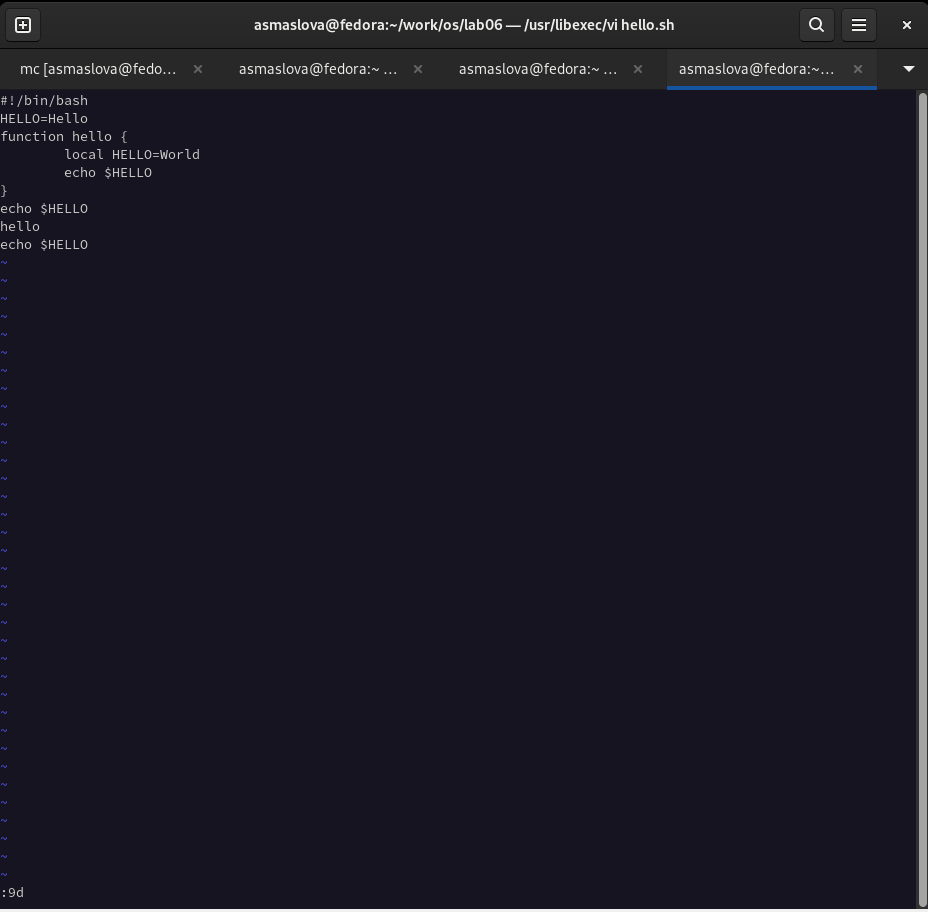
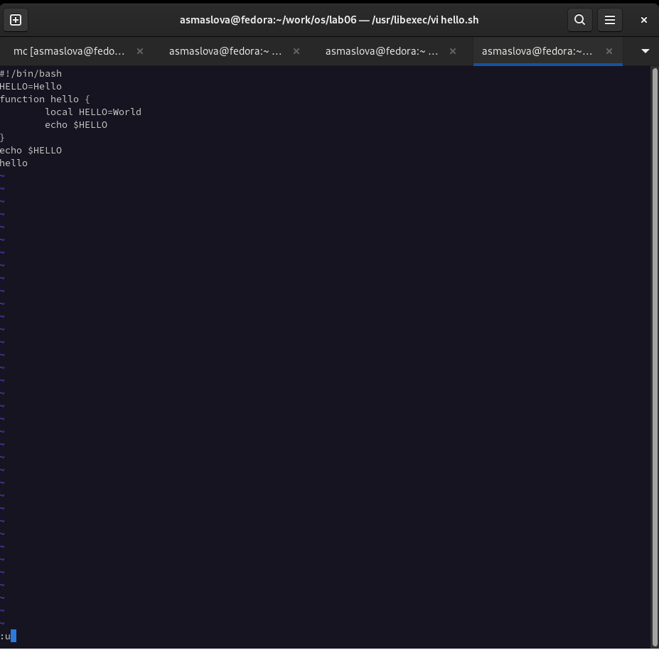
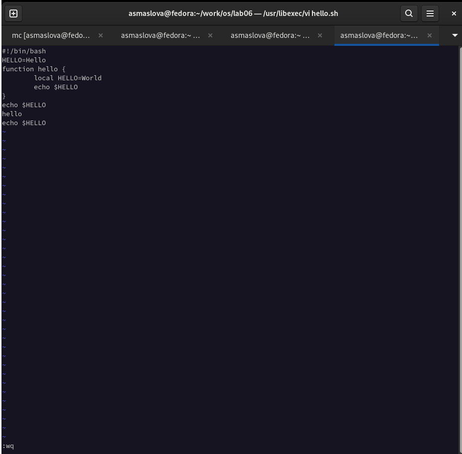

---
## Front matter
title: "Лабораторная работа №8"
subtitle: "Дисциплина: Операционные системы"
author: "Маслова Анастасия Сергеевна"

## Generic otions
lang: ru-RU
toc-title: "Содержание"

## Bibliography
bibliography: bib/cite.bib
csl: pandoc/csl/gost-r-7-0-5-2008-numeric.csl

## Pdf output format
toc: true # Table of contents
toc-depth: 2
lof: true # List of figures
lot: true # List of tables
fontsize: 12pt
linestretch: 1.5
papersize: a4
documentclass: scrreprt
## I18n polyglossia
polyglossia-lang:
  name: russian
  options:
	- spelling=modern
	- babelshorthands=true
polyglossia-otherlangs:
  name: english
## I18n babel
babel-lang: russian
babel-otherlangs: english
## Fonts
mainfont: PT Serif
romanfont: PT Serif
sansfont: PT Sans
monofont: PT Mono
mainfontoptions: Ligatures=TeX
romanfontoptions: Ligatures=TeX
sansfontoptions: Ligatures=TeX,Scale=MatchLowercase
monofontoptions: Scale=MatchLowercase,Scale=0.9
## Biblatex
biblatex: true
biblio-style: "gost-numeric"
biblatexoptions:
  - parentracker=true
  - backend=biber
  - hyperref=auto
  - language=auto
  - autolang=other*
  - citestyle=gost-numeric
## Pandoc-crossref LaTeX customization
figureTitle: "Рис."
tableTitle: "Таблица"
listingTitle: "Листинг"
lofTitle: "Список иллюстраций"
lotTitle: "Список таблиц"
lolTitle: "Листинги"
## Misc options
indent: true
header-includes:
  - \usepackage{indentfirst}
  - \usepackage{float} # keep figures where there are in the text
  - \floatplacement{figure}{H} # keep figures where there are in the text
---

# Цель работы

Познакомиться с операционной системой Linux. Получить практические навыки работы с редактором vi, установленным по умолчанию практически во всех дистрибутивах.

# Задание

1. Ознакомиться с теоретическим материалом.
2. Ознакомиться с редактором vi.
3. Выполнить упражнения, используя команды vi.

# Теоретическое введение

В большинстве дистрибутивов Linux в качестве текстового редактора по умолчанию устанавливается интерактивный экранный редактор vi (Visual display editor).
Редактор vi имеет три режима работы:
- командный режим — предназначен для ввода команд редактирования и навигации по редактируемому файлу;
- режим вставки — предназначен для ввода содержания редактируемого файла;
- режим последней (или командной) строки — используется для записи изменений в файл и выхода из редактора.
Для вызова редактора vi необходимо указать команду vi и имя редактируемого файла:

```bash
vi <имя_файла>
```

При этом в случае отсутствия файла с указанным именем будет создан такой файл. 
Переход в командный режим осуществляется нажатием клавиши Esc . Для выхода из редактора vi необходимо перейти в режим последней строки: находясь в командном режиме, нажать Shift-; (по сути символ : — двоеточие), затем:
- набрать символы wq, если перед выходом из редактора требуется записать изменения в файл;
- набрать символ q (или q!), если требуется выйти из редактора без сохранения.
Замечание. Следует помнить, что vi различает прописные и строчные буквы при наборе (восприятии) команд.

Более подробно см. [здесь](https://esystem.rudn.ru/pluginfile.php/1383181/mod_resource/content/4/008-lab_vi.pdf).

# Выполнение лабораторной работы

1. Я создала каталог с именем ~/work/os/lab06, перешла во вновь созданный каталог, вызвала vi и создала файл hello.sh.
```bash
vi hello.sh
```
2. Далее я нажала клавишу i и ввела следующий текст (рис.1):
```bash
#!/bin/bash
HELL=Hello
function hello {
LOCAL HELLO=World
echo $HELLO
}
echo $HELLO
hello
```

{ #fig:001 width=70% }

3. После этого я нажала клавишу Esc для перехода в командный режим после завершения ввода текста.
4. Затем я нажала : для перехода в режим последней строки, и внизу моего экрана появилось приглашение в виде двоеточия, после чего я нажала w (записать) и q (выйти), а затем нажала клавишу Enter для сохранения моего текста и завершения работы.
7. После этого я сделала файл исполняемым с помощью chmod:
```bash
chmod +x hello.sh
```
8. Далее я вызвала vi на редактирование файла:
```bash
vi ~/work/os/lab06/hello.sh
```
9. Я установила курсор в конец слова HELL второй строки, перешла в режим вставки и заменила на HELLO, после чего нажала Esc для возврата в командный режим, установила курсор на четвертую строку и стерла слово LOCAL.
10. После этого я перешла в режим вставки и набрала следующий текст: local, нажала Esc для возврата в командный режим, установила курсор на последней строке файла, вставила после неё строку, содержащую следующий текст: echo $HELLO, нажала Esc для перехода в командный режим, удалила последнюю строку (рис.2), ввела команду отмены изменений u для отмены последней команды (рис.3), ввела символ : для перехода в режим последней строки, записала произведённые изменения и вышла из vi (рис.4).

{ #fig:001 width=70% }

{ #fig:001 width=70% }

{ #fig:001 width=70% }

# Выводы

В ходе лабораторной работы я познакомилась с операционной системой Linux и получила практические навыки работы с редактором vi, установленным по умолчанию практически во всех дистрибутивах.

# Список литературы{.unnumbered}

::: {#refs}
:::
