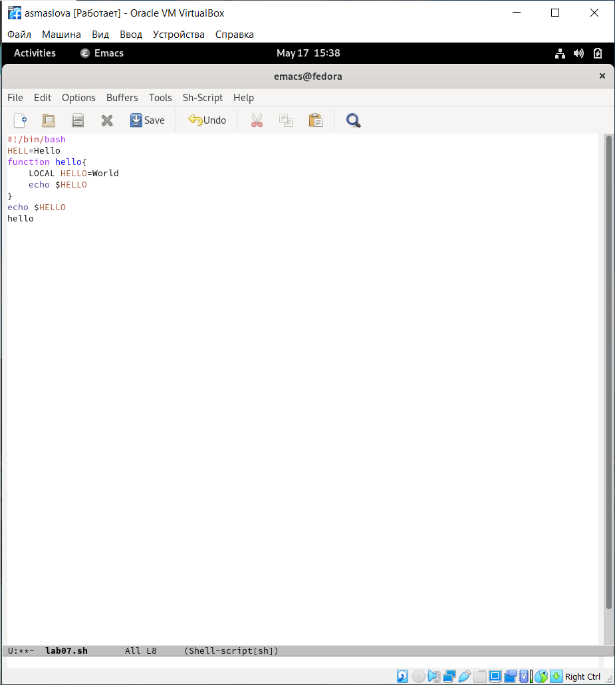
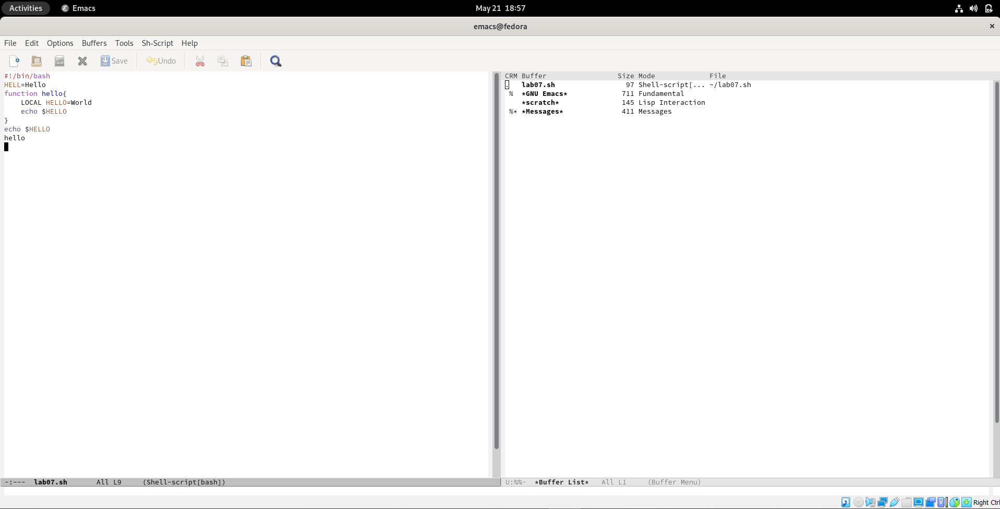
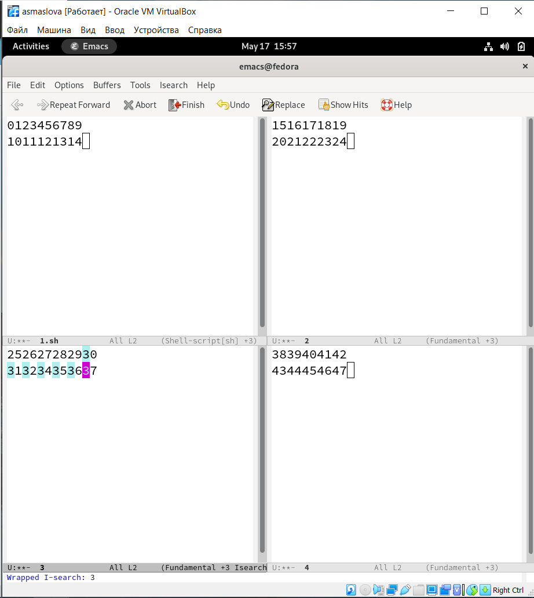

---
## Front matter
lang: ru-RU
title: Лабораторная работа №9
author: |
	Маслова Анастасия{1}
institute: |
	\inst{1}RUDN University, Moscow, Russian Federation

## Formatting
toc: false
slide_level: 2
theme: metropolis
header-includes: 
 - \metroset{progressbar=frametitle,sectionpage=progressbar,numbering=fraction}
 - '\makeatletter'
 - '\beamer@ignorenonframefalse'
 - '\makeatother'
aspectratio: 43
section-titles: true
---

# Цель работы

Познакомиться с операционной системой Linux. Получить практические навыки работы с редактором Emacs.

# Задание

1. Ознакомиться с теоретическим материалом.
2. Ознакомиться с редактором emacs.
3. Выполнить упражнения.
4. Ответить на контрольные вопросы.

# Выполнение лабораторной работы

Ознакомившись с теоретическим материалом и редактором emacs, я приступила к выполнению упражнений.

#
1. Я открыла emacs, создала файл lab07.sh с помощью комбинации Ctrl-x Ctrl-f (C-x C-f) и набрала текст:
```bash
#!/bin/bash
HELL=Hello
function hello {
LOCAL HELLO=World
echo $HELLO
}
echo $HELLO
hello
```
#
Далее я сохранила файл с помощью комбинации Ctrl-x Ctrl-s (C-x C-s) (рис.1).

{ #fig:001 width=70% }

#
2. Далее я проделала с текстом стандартные процедуры редактирования, каждое действие осуществила комбинацией клавиш. Я вырезала одной командой целую строку (С-k), вставила эту строку в конец файла (С-у), выделила область текста (C-space), скопировала область в буфер обмена (M-w), вставила область в конец файла, вновь выделила эту область и на этот раз вырезала её (C-w), после чего отменила последнее действие (C-/).

#
3. Далее, чтобы научиться использовать команды по перемещению курсора, я переместила курсор в начало строки (C-a), переместила курсор в конец строки (C-e), переместила курсор в начало буфера (M-<) и переместила курсор в конец буфера (M->).

#
4. Чтобы научиться управлять буферами, я вывела список активных буферов на экран (C-x C-b), переместила во вновь открытое окно (C-x) со списком открытых буферов и переключилась на другой буфер, после чего закрыла это окно (C-x 0). Далее я вновь переключилась между буферами, но уже без вывода их списка на экран (C-x b) (рис.2).

{ #fig:001 width=70% }

#
5. Чтобы научиться управлять окнами, я поделила фрейм на 4 части: разделила фрейм на два окна по вертикали (C-x 3), а затем каждое из этих окон на две части по горизонтали (C-x 2). В каждом из четырёх созданных окон я открыла новый буфер (файл) и введите несколько строк текста (рис.3).

{ #fig:001 width=70% }

#
6. Чтобы овладеть режимом поиска, я переключилась в режим поиска (C-s) и нашла несколько слов, присутствующих в тексте. Далее я переключалась между результатами поиска, нажимая C-s, после чего вышла из режима поиска, нажав C-g. Затем я перешла в режим поиска и замены (M-%), ввела текст, который следует найти и заменить, нажала Enter, затем ввела текст для замены. После того как были подсвечены результаты поиска, я нажала ! для подтверждения замены.

# Выводы

По итогам лабораторной работы я получила практические навыки в работе с графическим редактором emacs.

# Список литературы{.unnumbered}

::: {#refs}
:::
