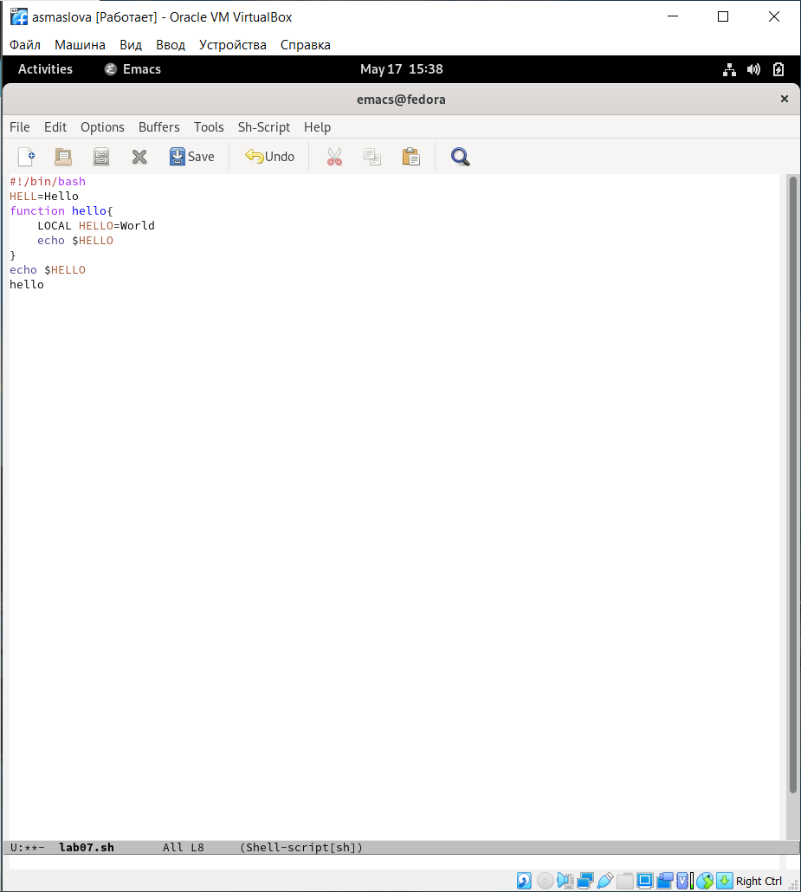
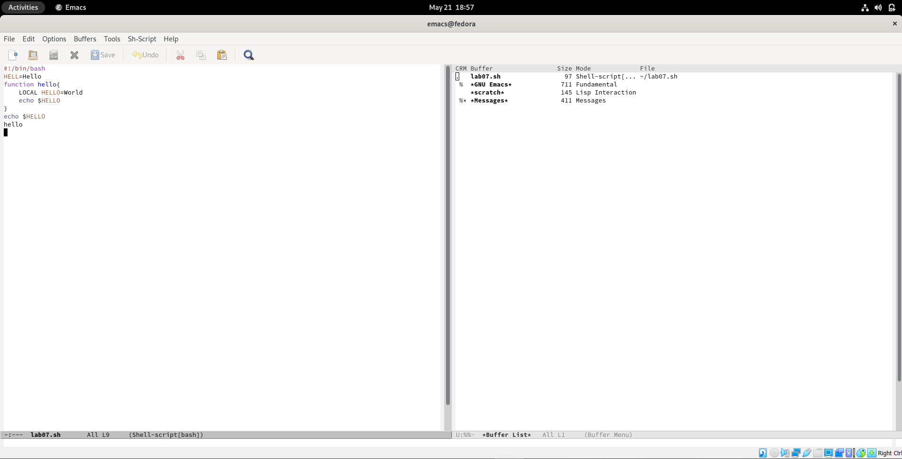
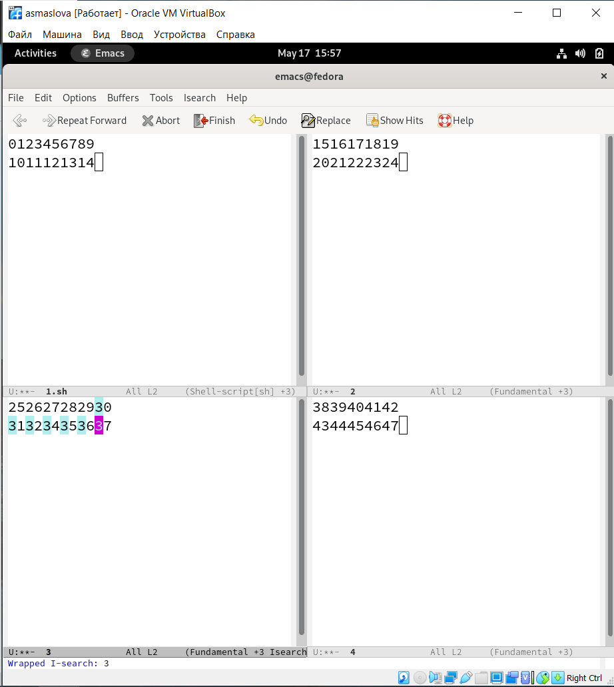

---
## Front matter
title: "Отчет к лабораторной работе №9"
subtitle: "Дисциплина: Операционные системы"
author: "Маслова Анастасия Сергеевна"

## Generic otions
lang: ru-RU
toc-title: "Содержание"

## Bibliography
bibliography: bib/cite.bib
csl: pandoc/csl/gost-r-7-0-5-2008-numeric.csl

## Pdf output format
toc: true # Table of contents
toc-depth: 2
lof: true # List of figures
lot: true # List of tables
fontsize: 12pt
linestretch: 1.5
papersize: a4
documentclass: scrreprt
## I18n polyglossia
polyglossia-lang:
  name: russian
  options:
	- spelling=modern
	- babelshorthands=true
polyglossia-otherlangs:
  name: english
## I18n babel
babel-lang: russian
babel-otherlangs: english
## Fonts
mainfont: PT Serif
romanfont: PT Serif
sansfont: PT Sans
monofont: PT Mono
mainfontoptions: Ligatures=TeX
romanfontoptions: Ligatures=TeX
sansfontoptions: Ligatures=TeX,Scale=MatchLowercase
monofontoptions: Scale=MatchLowercase,Scale=0.9
## Biblatex
biblatex: true
biblio-style: "gost-numeric"
biblatexoptions:
  - parentracker=true
  - backend=biber
  - hyperref=auto
  - language=auto
  - autolang=other*
  - citestyle=gost-numeric
## Pandoc-crossref LaTeX customization
figureTitle: "Рис."
tableTitle: "Таблица"
listingTitle: "Листинг"
lofTitle: "Список иллюстраций"
lotTitle: "Список таблиц"
lolTitle: "Листинги"
## Misc options
indent: true
header-includes:
  - \usepackage{indentfirst}
  - \usepackage{float} # keep figures where there are in the text
  - \floatplacement{figure}{H} # keep figures where there are in the text
---

# Цель работы

Познакомиться с операционной системой Linux. Получить практические навыки работы с редактором Emacs.

# Задание

1. Ознакомиться с теоретическим материалом.
2. Ознакомиться с редактором emacs.
3. Выполнить упражнения.
4. Ответить на контрольные вопросы.

# Теоретическое введение

**Определение 1.** Буфер — объект, представляющий какой-либо текст. Буфер может содержать что угодно, например, результаты компиляции программы или встроенные подсказки. Практически всё взаимодействие с пользователем, в том числе интерактивное, происходит посредством буферов.

**Определение 2.** Фрейм соответствует окну в обычном понимании этого слова. Каждый фрейм содержит область вывода и одно или несколько окон Emacs.

**Определение 3.** Окно — прямоугольная область фрейма, отображающая один из буферов. Каждое окно имеет свою строку состояния, в которой выводится следующая информация: название буфера, его основной режим, изменялся ли текст буфера и как далеко внизпо буферу расположен курсор. Каждый буфер находится только в одном из возможных основных режимов. Существующие основные режимы включают режим Fundamental (наименее специализированный), режим Text, режим Lisp, режим С, режим Texinfo и другие. Под второстепенными режимами понимается список режимов, которые включены в данный момент в буфере выбранного окна.

**Определение 5.** Минибуфер используется для ввода дополнительной информации и всегда отображается в области вывода.

**Определение 6.** Точка вставки — место вставки (удаления) данных в буфере.

## Основы работы в Emacs

Для запуска Emacs необходимо в командной строке набрать emacs (или emacs & для работы в фоновом режиме относительно консоли). Для работы с Emacs можно использовать как элементы меню, так и различные сочетания клавиш. Например, для выхода из Emacs можно воспользоваться меню File и выбрать пункт Quit , а можно нажать последовательно Ctrl-x Ctrl-c (в обозначениях Emacs: C-x C-c).

Многие рутинные операции в Emacs удобнее производить с помощью клавиатуры, а не графического меню. Наиболее часто в командах Emacs используются сочетания c клавишами Ctrl и Meta (в обозначениях Emacs: C- и M-; клавиша Shift в Emasc обозначается как S-). Так как на клавиатуре для IBM PC совместимых ПК клавиши Meta нет, то вместо неё можно использовать Alt или Esc . Для доступа к системе меню используйте клавишу F10.

Клавиши Ctrl , Meta и Shift принято называть префиксными. Например, запись M-x означает, что надо удерживая клавишу Meta (или Alt ), нажать на клавишу x.Для открытия файла следует использовать команду C-x C-f (надо, удерживая клавишу Ctrl , нажать на клавишу x , затем отпустить обе клавиши и снова, удерживая клавишу Ctrl , нажать на клавишу f ).

По назначению префиксные сочетания клавиш различаются следующим образом:
	– C-x — префикс ввода основных команд редактора (например, открытия, закрытии, сохранения файла и т.д.);
	– C-c — префикс вызова функций, зависящих от используемого режима.
	
**Определение 7.** Режим — пакет расширений, изменяющий поведение буфера Emacs при редактировании и просмотре текста (например, для редактирования исходного текста программ на языках С или Perl).

В табл. [-@tbl:9.1] приведены основные комбинации клавиш, используемые для перемещения курсора в буфере Emacs (также работают и обычные навигационные клавиши, например, стрелки).

: Основные комбинации клавиш, используемые для перемещения курсора в буфере Emacs {#tbl:9.1} 

| Имя каталога | Описание каталога                                                                                                          |
|--------------|----------------------------------------------------------------------------------------------------------------------------|
| `C-p`        | переместиться вверх на одну строку                                               	                                    |
| `C-n`        | переместиться вниз на одну строку							    			            |
| `C-f`        | переместиться вперёд на один символ                                        						    |
| `C-b`        | переместиться назад на один символ 							  				    |
| `C-a`        | переместиться в начало строки                                                                              		    |
| `C-e`        | переместиться в конец строки                                                                                  		    |
| `C-v`        | переместиться вниз на одну страницу                                                                    	            |
| `M-v`        | переместиться вверх на одну страницу                                                                                       |
| `M-f`        | переместиться вперёд на одно слово 											    |
| `M-b`        | переместиться назад на одно слово                                                                                          |
| `M-<`        | переместиться в начало буфера                                                                                		    |
| `M->`        | переместиться в конец буфера                                                                                               |
| `C-g`        | закончить текущую операцию                                                                              		    |

Более подробная теоретическая справка - [здесь](https://esystem.rudn.ru/pluginfile.php/1383183/mod_resource/content/5/009-lab_emacs.pdf).

# Выполнение лабораторной работы

Ознакомившись с теоретическим материалом и редактором emacs, я приступила к выполнению упражнений.
1. Я открыла emacs, создала файл lab07.sh с помощью комбинации Ctrl-x Ctrl-f (C-x C-f) и набрала текст:
```bash
#!/bin/bash
HELL=Hello
function hello {
LOCAL HELLO=World
echo $HELLO
}
echo $HELLO
hello
```
Далее я сохранила файл с помощью комбинации Ctrl-x Ctrl-s (C-x C-s) (рис.1).

{ #fig:001 width=70% }

2. Далее я проделала с текстом стандартные процедуры редактирования, каждое действие осуществила комбинацией клавиш. Я вырезала одной командой целую строку (С-k), вставила эту строку в конец файла (С-у), выделила область текста (C-space), скопировала область в буфер обмена (M-w), вставила область в конец файла, вновь выделила эту область и на этот раз вырезала её (C-w), после чего отменила последнее действие (C-/).
3. Далее, чтобы научиться использовать команды по перемещению курсора, я переместила курсор в начало строки (C-a), переместила курсор в конец строки (C-e), переместила курсор в начало буфера (M-<) и переместила курсор в конец буфера (M->).
4. Чтобы научиться управлять буферами, я вывела список активных буферов на экран (C-x C-b), переместила во вновь открытое окно (C-x) со списком открытых буферов и переключилась на другой буфер, после чего закрыла это окно (C-x 0). Далее я вновь переключилась между буферами, но уже без вывода их списка на экран (C-x b) (рис.2).

{ #fig:001 width=70% }

5. Чтобы научиться управлять окнами, я поделила фрейм на 4 части: разделила фрейм на два окна по вертикали (C-x 3), а затем каждое из этих окон на две части по горизонтали (C-x 2). В каждом из четырёх созданных окон я открыла новый буфер (файл) и введите несколько строк текста (рис.3).

{ #fig:001 width=70% }

6. Чтобы овладеть режимом поиска, я переключилась в режим поиска (C-s) и нашла несколько слов, присутствующих в тексте. Далее я переключалась между результатами поиска, нажимая C-s, после чего вышла из режима поиска, нажав C-g. Затем я перешла в режим поиска и замены (M-%), ввела текст, который следует найти и заменить, нажала Enter, затем ввела текст для замены. После того как были подсвечены результаты поиска, я нажала ! для подтверждения замены.

# Выводы

По итогам лабораторной работы я получила практические навыки в работе с графическим редактором emacs.

# Список литературы{.unnumbered}

::: {#refs}
:::
