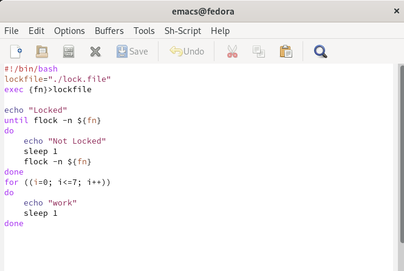
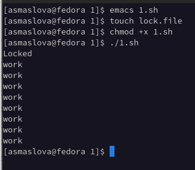
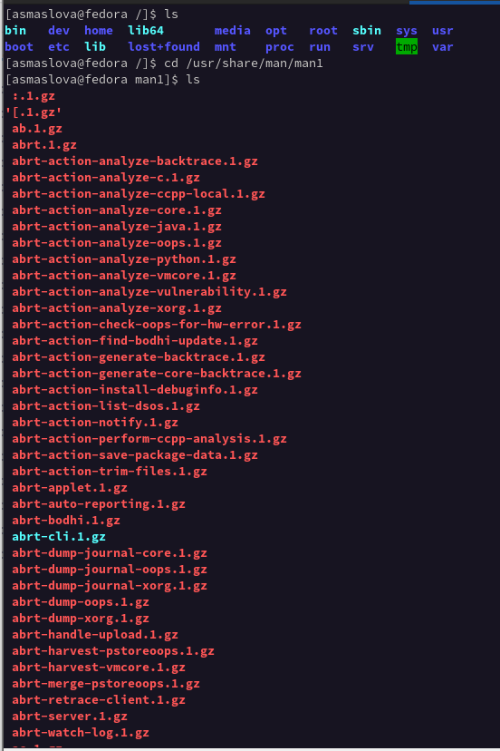
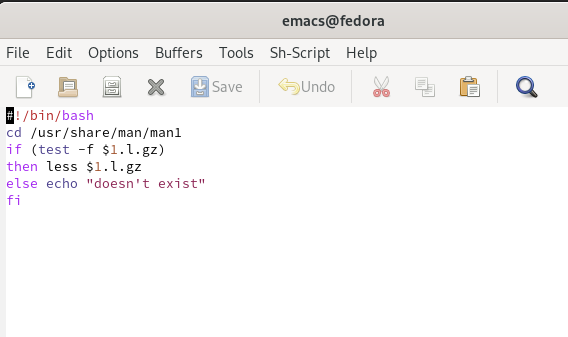
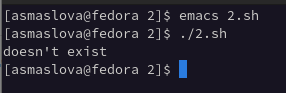
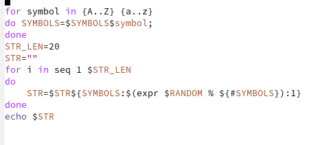
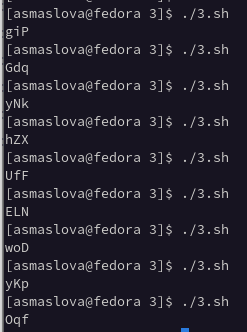

---
## Front matter
lang: ru-RU
title: Лабораторная работа №12
author: |
	Маслова Анастасия Сергеевна\inst{1}
institute: |
	\inst{1}RUDN University, Moscow, Russian Federation

## Formatting
toc: false
slide_level: 2
theme: metropolis
header-includes: 
 - \metroset{progressbar=frametitle,sectionpage=progressbar,numbering=fraction}
 - '\makeatletter'
 - '\beamer@ignorenonframefalse'
 - '\makeatother'
aspectratio: 43
section-titles: true
---

# Цель работы

Изучить основы программирования в оболочке ОС UNIX. Научиться писать более сложные командные файлы с использованием логических управляющих конструкций и циклов.

# Выполнение лабораторной работы

1. Я написала командный файл, реализующий упрощённый механизм семафоров. Данный командный файл в течение некоторого времени t1 дожидается освобождения ресурса, выдавая об этом сообщение, а дождавшись его освобождения, использует его в течение некоторого времени t2<>t1, также выдавая информацию о том, что ресурс используется соответствующим командным файлом (процессом) (рис.1 и рис.2).

#

{ #fig:001 width=70% }

#

{ #fig:001 width=70% }

#

2. Далее я написала командный файл, который получает в виде аргумента командной строки название команды и в виде результата выдает справку об этой команде или сообщение об отсутствии справки, если соответствующего файла нет в каталоге man1. Перед этим я изучила содержимое каталога /usr/share/man/man1 (рис.3, рис.4 и рис.5).

#

{ #fig:001 width=70% }

#

{ #fig:001 width=70% }

#

{ #fig:001 width=70% }

#

3. Используя встроенную переменную $RANDOM, я написала командный файл, генерирующий случайную последовательность букв латинского алфавита (рис.6 и рис.7)

#

{ #fig:001 width=70% }

#

{ #fig:001 width=70% }

# Выводы

В ходе лабораторной работы я изучила основы программирования в оболочке ОС UNIX и научилась писать более сложные командные файлы с использованием логических управляющих конструкций и циклов.
