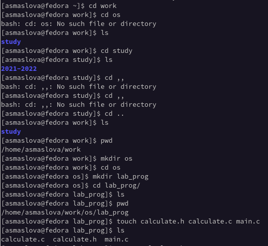
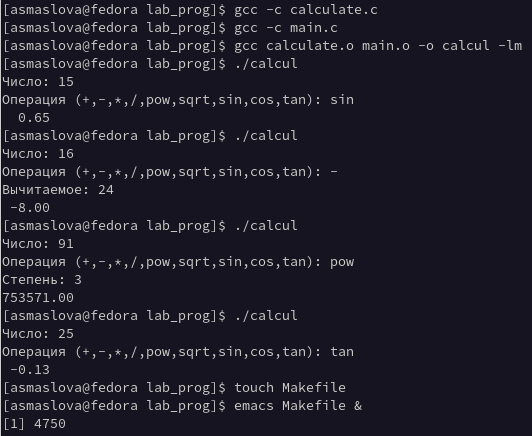
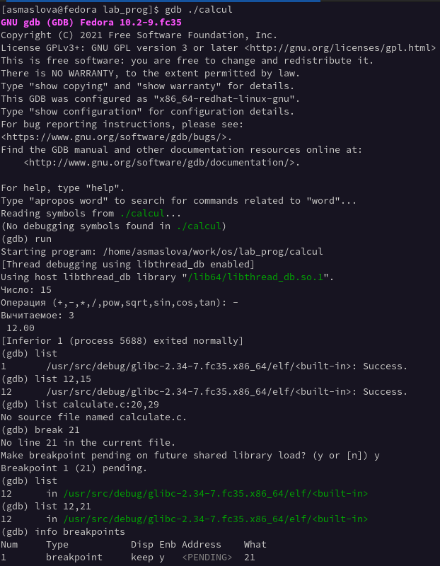
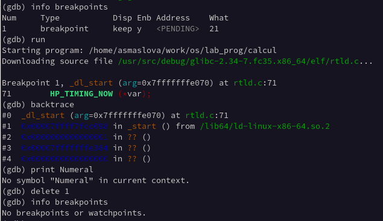
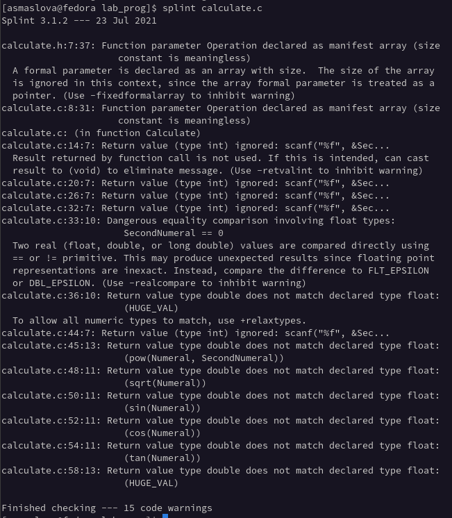

---
## Front matter
lang: ru-RU
title: Лабораторная работа №13
author: |
	Маслова Анастасия Сергеевна\inst{1}
institute: |
	\inst{1}RUDN University, Moscow, Russian Federation

## Formatting
toc: false
slide_level: 2
theme: metropolis
header-includes: 
 - \metroset{progressbar=frametitle,sectionpage=progressbar,numbering=fraction}
 - '\makeatletter'
 - '\beamer@ignorenonframefalse'
 - '\makeatother'
aspectratio: 43
section-titles: true
---

# Цель работы

Приобрести простейшие навыки разработки, анализа, тестирования и отладки приложений в ОС типа UNIX/Linux на примере создания на языке программирования С калькулятора с простейшими функциями.

# Выполнение лабораторной работы

#
1. В домашнем каталоге я создала подкаталог ~/work/os/lab_prog.

#
2. Создала в нём файлы: calculate.h, calculate.c, main.c и в них написала код по примеру лабораторной работы (рис.1).

#
{ #fig:001 width=70% }

#
3. Далее я выполнила компиляцию программы посредством gcc (рис.2).

#
{ #fig:001 width=70% }

#
4. Синтаксических ошибок компилятор мне не выдал, поэтому я ничего не исправляла, вместо этого я проверила работу программы и убедилась, что она работает.
5. После этого я создала Makefile с необходимым содержанием (рис.2).
6. С помощью gdb выполните отладку программы calcul (рис.3-4)

#
{ #fig:001 width=70% }

#
{ #fig:001 width=70% }

#
7. С помощью утилиты splint я попробовала проанализировать коды файлов calculate.c и main.c и увидела множество синтаксических ошибок, которые не выдал компилятор (рис.5).

#
{ #fig:001 width=70% }

# Выводы

В результате лабораторной работы я приобрела простейшие навыки разработки, анализа, тестирования и отладки приложений в ОС типа UNIX/Linux на примере создания на языке программирования С калькулятора с простейшими функциями.
