---
## Front matter
lang: ru-RU
title: Лабораторная работа №14
author: |
	Маслова Анастасия Сергеевна\inst{1}
institute: |
	\inst{1}RUDN University, Moscow, Russian Federation

## Formatting
toc: false
slide_level: 2
theme: metropolis
header-includes: 
 - \metroset{progressbar=frametitle,sectionpage=progressbar,numbering=fraction}
 - '\makeatletter'
 - '\beamer@ignorenonframefalse'
 - '\makeatother'
aspectratio: 43
section-titles: true
---

# Цель работы

Приобретение практических навыков работы с именованными каналами.

# Выполнение лабораторной работы

1. Работает не 1 клиент, а несколько (например, два).

#
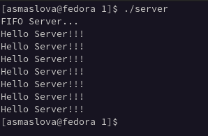{ #fig:001 width=70% }

#
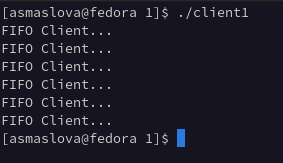{ #fig:001 width=70% }

#
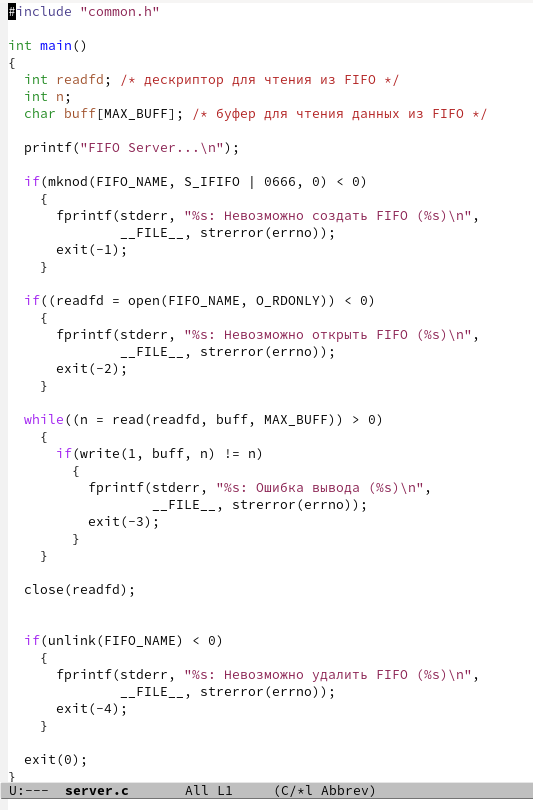{ #fig:001 width=70% }

#
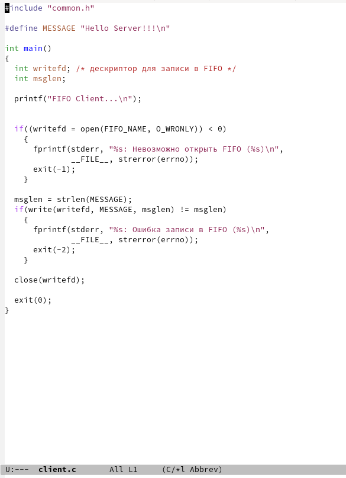{ #fig:001 width=70% }

#
2. Клиенты передают текущее время с некоторой периодичностью (например, раз в пять секунд). Используйте функцию sleep() для приостановки работы клиента.

#
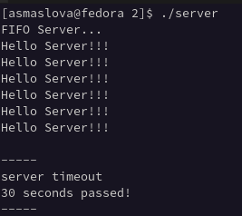{ #fig:001 width=70% }

#
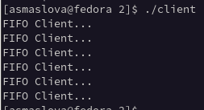{ #fig:001 width=70% }

#
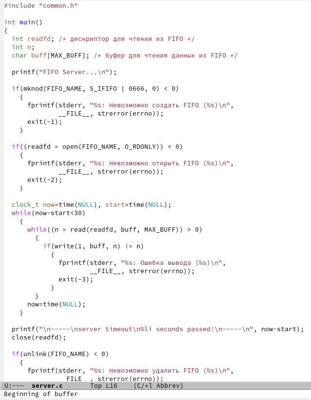{ #fig:001 width=70% }

#
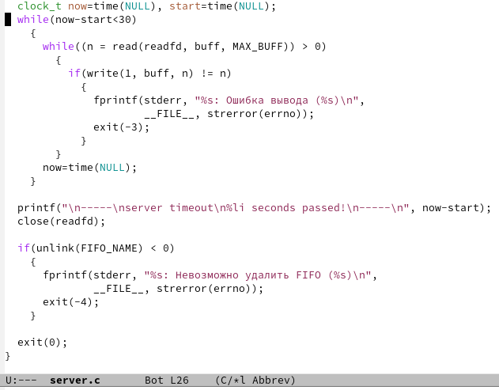{ #fig:001 width=70% }

#
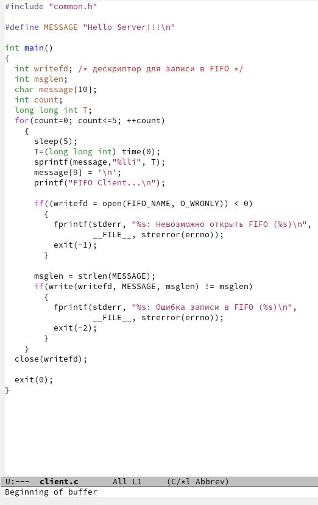{ #fig:001 width=70% }

#
3. Сервер работает не бесконечно, а прекращает работу через некоторое время (например, 30 сек). Используйте функцию clock() для определения времени работы сервера. Что будет в случае, если сервер завершит работу, не закрыв канал?

#
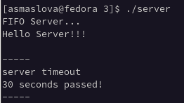{ #fig:001 width=70% }

#
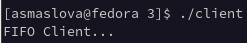{ #fig:001 width=70% }

#
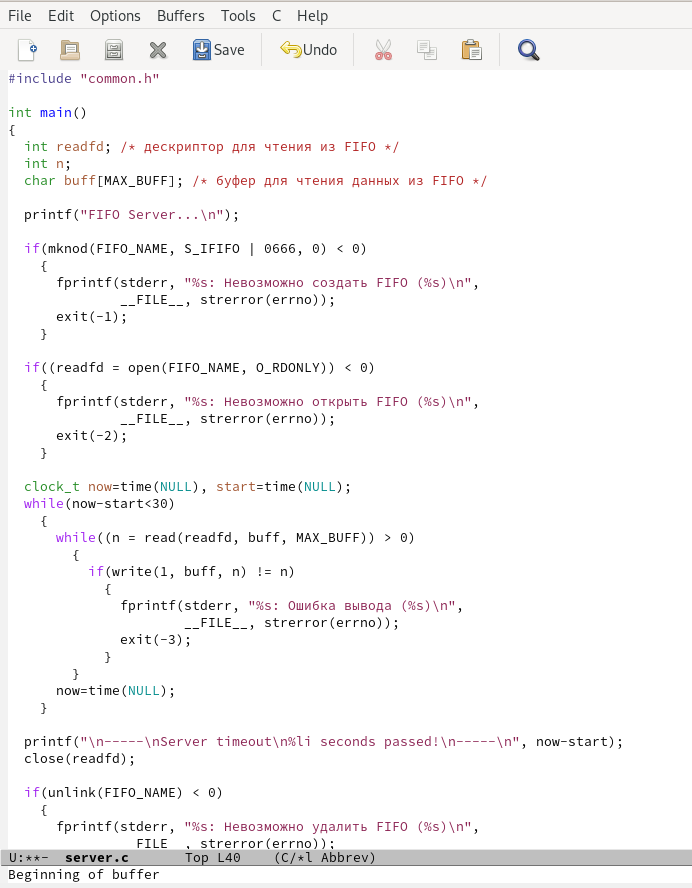{ #fig:001 width=70% }

#
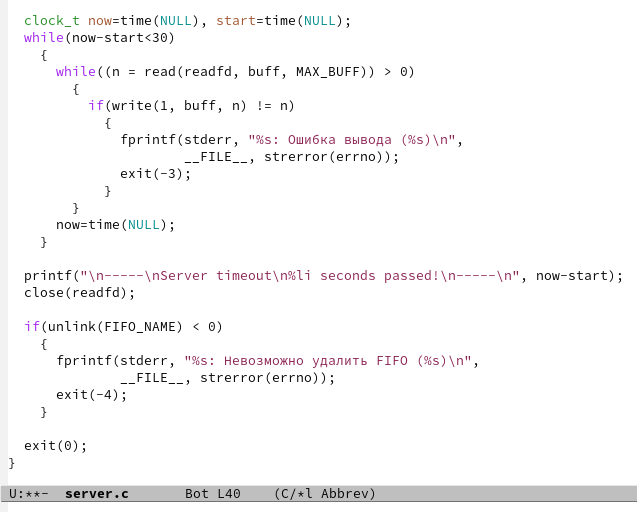{ #fig:001 width=70% }

#
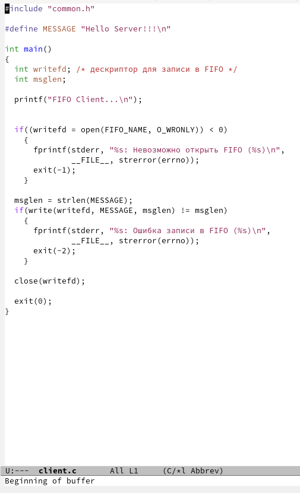{ #fig:001 width=70% }

# Выводы

В ходе выполнения лабораторной работы я приобрела практические навыки работы с именованными каналами.
