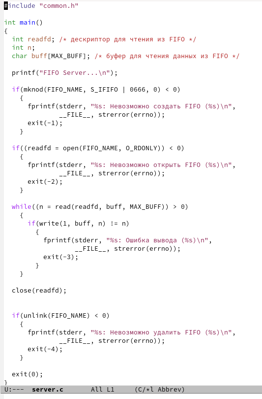
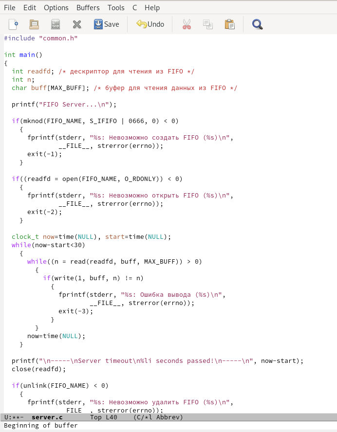

---
## Front matter
title: "Лабораторная работа №14"
subtitle: "Дисциплина: Операционные системы"
author: "Маслова Анастасия Сергеевна"

## Generic otions
lang: ru-RU
toc-title: "Содержание"

## Bibliography
bibliography: bib/cite.bib
csl: pandoc/csl/gost-r-7-0-5-2008-numeric.csl

## Pdf output format
toc: true # Table of contents
toc-depth: 2
lof: true # List of figures
lot: true # List of tables
fontsize: 12pt
linestretch: 1.5
papersize: a4
documentclass: scrreprt
## I18n polyglossia
polyglossia-lang:
  name: russian
  options:
	- spelling=modern
	- babelshorthands=true
polyglossia-otherlangs:
  name: english
## I18n babel
babel-lang: russian
babel-otherlangs: english
## Fonts
mainfont: PT Serif
romanfont: PT Serif
sansfont: PT Sans
monofont: PT Mono
mainfontoptions: Ligatures=TeX
romanfontoptions: Ligatures=TeX
sansfontoptions: Ligatures=TeX,Scale=MatchLowercase
monofontoptions: Scale=MatchLowercase,Scale=0.9
## Biblatex
biblatex: true
biblio-style: "gost-numeric"
biblatexoptions:
  - parentracker=true
  - backend=biber
  - hyperref=auto
  - language=auto
  - autolang=other*
  - citestyle=gost-numeric
## Pandoc-crossref LaTeX customization
figureTitle: "Рис."
tableTitle: "Таблица"
listingTitle: "Листинг"
lofTitle: "Список иллюстраций"
lotTitle: "Список таблиц"
lolTitle: "Листинги"
## Misc options
indent: true
header-includes:
  - \usepackage{indentfirst}
  - \usepackage{float} # keep figures where there are in the text
  - \floatplacement{figure}{H} # keep figures where there are in the text
---

# Цель работы

Приобретение практических навыков работы с именованными каналами.

# Задание
Изучите приведённые в тексте программы server.c и client.c. Взяв данные примеры за образец, напишите аналогичные программы, внеся следующие изменения:
1. Работает не 1 клиент, а несколько (например, два).
2. Клиенты передают текущее время с некоторой периодичностью (например, раз в пять секунд). Используйте функцию sleep() для приостановки работы клиента.
3. Сервер работает не бесконечно, а прекращает работу через некоторое время (например, 30 сек). Используйте функцию clock() для определения времени работы сервера. Что будет в случае, если сервер завершит работу, не закрыв канал?

# Теоретическое введение

Одним из видов взаимодействия между процессами в операционных системах является обмен сообщениями. Под сообщением понимается последовательность байтов, передаваемая от одного процесса другому. 
В операционных системах типа UNIX есть 3 вида межпроцессорных взаимодействий: общеюниксные (именованные каналы, сигналы), System V Interface Definition (SVID — разделяемая память, очередь сообщений, семафоры) и BSD (сокеты).
Для передачи данных между неродственными процессами можно использовать механизм именованных каналов (named pipes). Данные передаются по принципу FIFO (First In First Out) (первым записан — первым прочитан), поэтому они называются также FIFO pipes или просто FIFO. Именованные каналы отличаются от неименованных наличием идентификатора канала, который представлен как специальный файл (соответственно имя именованного канала — это имя файла). Поскольку файл находится на локальной файловой системе, данное IPC используется внутри одной системы.

Более подробно - [здесь.](https://esystem.rudn.ru/pluginfile.php/1383193/mod_resource/content/3/014-ipc-fifo.pdf)

# Выполнение лабораторной работы

1. Работает не 1 клиент, а несколько (например, два).

{ #fig:001 width=70% }
{ #fig:001 width=70% }
{ #fig:001 width=70% }
{ #fig:001 width=70% }

2. Клиенты передают текущее время с некоторой периодичностью (например, раз в пять секунд). Используйте функцию sleep() для приостановки работы клиента.
{ #fig:001 width=70% }
{ #fig:001 width=70% }
{ #fig:001 width=70% }
{ #fig:001 width=70% }
{ #fig:001 width=70% }

3. Сервер работает не бесконечно, а прекращает работу через некоторое время (например, 30 сек). Используйте функцию clock() для определения времени работы сервера. Что будет в случае, если сервер завершит работу, не закрыв канал?
{ #fig:001 width=70% }
{ #fig:001 width=70% }
{ #fig:001 width=70% }
{ #fig:001 width=70% }
{ #fig:001 width=70% }

# Выводы

В ходе выполнения лабораторной работы я приобрела практические навыки работы с именованными каналами.

# Список литературы{.unnumbered}

::: {#refs}
:::
